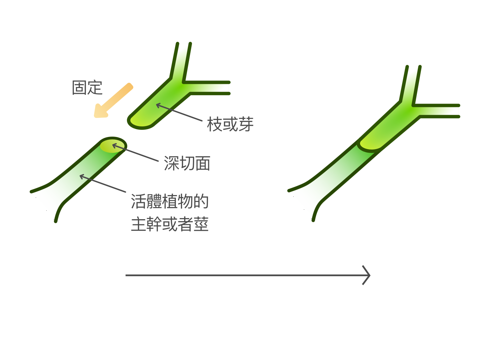
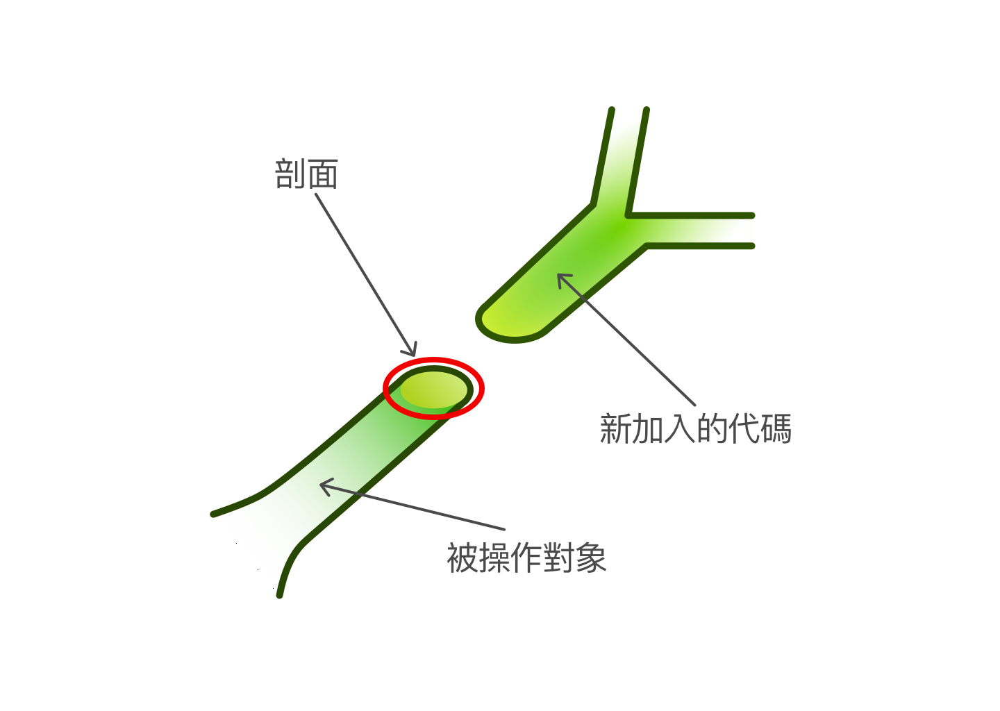
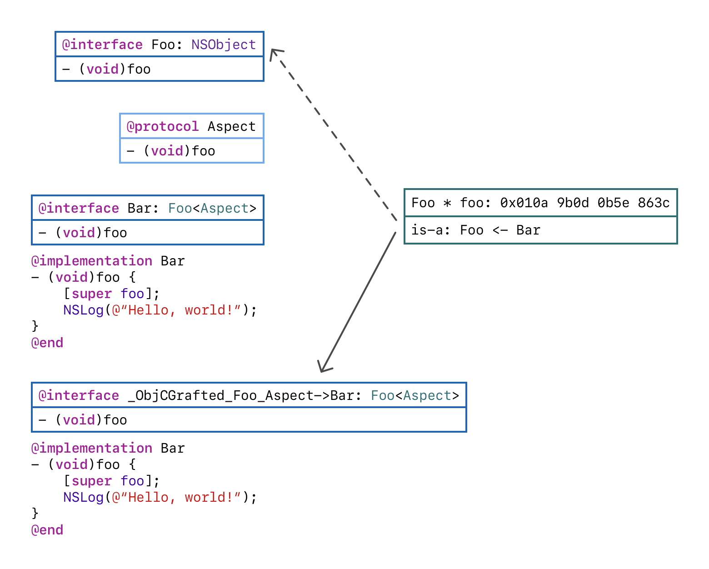
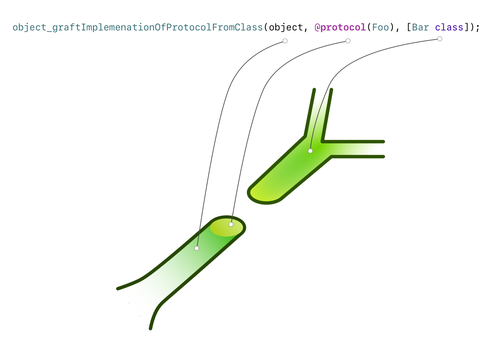

## 案例：干預 UIScrollView 的 Pan Gesture Recognizer
我們都知道， `UIScrollView` 將 pan gesture 信號轉換成 `scrollViewDidXXX:` 消息然後發送給它的 `delegate`，多數時候你只需要理解這兩者的關係然後在 `delegate` 監聽這些消息就可以了。但是如果你要干預 pan gesture recognizer 的工作怎麼辦？我是說，干預 pan gesture 的識別。

在這裏，如果我們不選擇修改 `UIScrollView` 的內部機制，那我們將不得不選擇創建一個子類。

由於 `UIScrollView` 的 pan gesture recognizer 將他的 `delegate` 固化成了擁有這個 gesture recognizer 的 `UIScrollView`，如果你將它的 `delegate` 設置爲其他的「中間人」，你將會得到一個運行時異常。在這裏，多數人都會想到創建一個子類。但是如果你期望這次修改也能影響其他 `UIScrollView` 的子類時怎麼辦？

在物件導向編程範式中我們並不鼓勵修改一個已存在的類的內部機制。因爲物件導向編程是建立在不斷作出**是什麼**的斷言上——一個類的所作所爲造就了這個類**是**這個類本身的原因，故而物件導向編程的核心概念之一便是「擴展而不是修改」。修改已存在的類的內部機制打破了這個範式。如果你選擇修改，那麼這個「**是什麼**」斷言便不成立了，軟件架構的基礎也就隨之開始動搖。

所以我們永遠不應該是某一種編程教派的狂熱信徒。這一次你需要剖面導向編程。有了它，你就可以不用創建一個新類而達到干預 pan gesture recognizer 的工作這個目的了。而這也可以影響到繼承自 `UIScrollView` 的子類。

## 剖面導向編程簡介
剖面導向編程可能是編程世界中最被解釋得過於複雜的術語了。

與剖面導向編程相比，最相似的概念我認爲應該是植物嫁接。

植物嫁接的意思是：將一顆植物的枝或芽固定在另一顆活體植物的主幹或者莖的深切面上，這樣枝或者芽就可以從這顆活體植物接受養分並繼續生長。



剖面導向編程着實類似植物嫁接。



如上圖所示，剖面導向編程關心如下三件事：

* 新加入的代碼
* 剖面
* 被操作的對象

我們可以將剖面導向編程中**新加入的代碼**比作植物嫁接中植物的**枝或芽**，將**剖面**比作**深切面**，將**被操作的對象**比作**活體植物**。於是剖面導向編程就是將這三者**固定**在一起的過程。

## Objective-C 和 Swift 中已經存在的剖面導向編程
在 Objective-C 中，關於剖面導向編程有一個誤解：蘋果官方並不支持剖面導向編程。

不是的。

Objective-C 中的 Key-Value Observation 就是一個特設的剖面導向編程框架，並且這是由蘋果帶來的官方特性。我們可以將 Key-Value Observation 代入之前的植物嫁接模型中：

* 被 Key-Value 觀察的對象其 property 變化事件觸發器就是植物的枝或芽（新加入的代碼）
* 可以被 Key-Value 觀察的 properties 就是深切面（剖面）
* 被 Key-Value 觀察的對象就是活體植物（被操作的對象）

於是我們可以知道，Key-Value Observation 就是剖面導向編程，但是這個「剖面」是「特設」的。蘋果沒有官方支持的是支持「通用」剖面的剖面導向編程。

剖面導向編程的情況在 Swift 中比較複雜。通過藉助 Objective-C，Swift 默認支持 Key-Value Observation。但是因爲函數調用的派發可以在編譯時被決議並且被寫入編譯產物，而 Key-Value Observation 又是在運行時生成代碼，這些編譯產物有可能永遠都不知道如何調用這些運行時生成的代碼。所以你需要將要被觀察的 properties 標記上 `@objc` 的屬性。這樣就會強制編譯器生成運行時決議該函數派發的代碼。

就像 Objective-C，在 Swift 中並沒有對支持「通用」剖面的剖面導向編程提供支持。

好了。蘋果造了個好框架然後我們非常開心，然而你還是不能達成干預 `UIScrollView` 的 pan gesture recognizer 的目的——這就是故事的結尾了嗎？

非也。

## 實現支持通用剖面的剖面導向編程
### 樸素的途徑
在 Objective-C 中，最簡單的不通過 subclassing 來修改一個類的實例其行爲的方法就是 method swizzling 了。網上有許多資料討論如何在 Objective-C 和 Swift 中進行 method swizzling 的，所以我並不想在這裏再重複一遍。我想說說這個途徑的缺點。

首先，method swizzling 是在類上幹活的。如果我們 swizzle 了 `UIScrollView`，那麼所有 UIScrollView 的及其子類的實例都會獲得同樣的行爲。

然後，雖然我們在進行剖面導向編程，這並不意味着我們就放棄了作「是什麼」斷言的行爲。而「作『是什麼』斷言」這種行爲是劃分組件責任邊界的關鍵步驟，也是不論什麼編程範式中的一塊基石。Method swizzling 是一種匿名的修改途徑，這種修改途徑繞過了「作『是什麼』斷言」，很容易動搖軟件架構的基礎，同時也是難以察覺和追蹤的。

再者，因爲 Swift 不支持重載 Objective-C 橋接類的 `class func load()` 方法，許多文章都建議你將 swizzle 代碼放入 `class func initialize()` 中去。因爲對於每一個模塊的每一個類，app 在啓動時只會調用一個 `class func initialize()` 的重載，於是你必須將同一個類的所有 swizzle 代碼都放入一個文件——否則你將搞不清楚啓動時到底將調用哪一個 `class func initialize()` 重載。這最終將導致 method swizzling 在代碼管理方面潛在的混亂。

### 成熟的途徑
一瞥官方支持的剖面導向編程框架 Key-Value Observation，我們可以察覺到其根本沒有我們說的上述缺點。蘋果是如何做到的？

實際上，蘋果是通過一種叫 is-a swizzling 的技術實現這個剖面導向編程框架的。

Is-a swizzling 十分簡單，甚至反映到代碼上都是——設置一個對象的 is-a 指針爲另一個類的。

```objectivec
Foo * foo = [[Foo alloc] init];
object_setClass(foo, [Bar class]);
```

而 Key-Value Observation 就是創建一個被觀察對象的類的子類，然後設置這個對象的 is-a 指針爲這個新建類的 is-a 指針。整個過程如下列代碼所示：

```objectivec
@interface Foo: NSObject
// ...
@end

@interface NSKVONotifying_Foo: Foo
// ...
@end

NSKVONotifying_Foo * foo = [[NSKVONotifying_Foo alloc] init];
object_setClass(foo, [NSKVONotifying_Foo class]);
```

因爲 Apple 已經給出了一個關於「特設」剖面導向編程的成熟的解決方案，那麼創建一個對象的類的子類，然後再將其 is-a 指針設置爲該對象的這條途徑應該是行得通的。但是當我們在做系統設計的時候，最重要的問題是：爲什麼應該是行得通的？

### KVO 設計分析
打開 Swift Playground 然後鍵入下列代碼：

```swift
import Cocoa

class Foo: NSObject {
    @objc var intValue: Int = 0
}

class Observer: NSObject { }

let foo = Foo()

let observer = Observer()

 We need to use `object_getClass` to check the real is-a pointer.

print(NSStringFromClass(object_getClass(foo)!))
print(NSStringFromClass(object_getClass(observer)!))

foo.addObserver(observer, forKeyPath: "intValue", options: .new, context: nil)

print(NSStringFromClass(object_getClass(foo)!))
print(NSStringFromClass(object_getClass(observer)!))
```

然後你會看到下列輸出：

```
__lldb_expr_2.Foo
__lldb_expr_2.Observer
NSKVONotifying___lldb_expr_2.Foo
__lldb_expr_2.Observer
```

`__lldb_expr_2` 是由 Swift Playground 生成並且由 Swift 編譯器在橋接 Swift 類至 Objective-C 時加入的模塊名。 `NSKVONotifying_` 是由 KVO 生成的保護性前綴。 `Foo` 和 `Observer` 是我們在代碼中使用的類名。

通過對 KVO 內部的一瞥，我們可以知道，KVO 爲被觀察的對象創建了一個新類。但是這就足夠了嗎？我是說，針對一個被觀察對象的類創建一個子類就夠了嗎？

由於 KVO 是一個成熟的框架，我們當然可以通過直覺回答「是」。但是如果我們這麼做了，那麼我們將喪失一次學習箇中原由的機會。

實際上，因爲在 KVO 觀察一個對象的 properties 中，所有可變的因素都在觀察者的事件處理函數：`[NSObject -observeValueForKeyPath:ofObject:change:context:]` 中，另一方面，又由於被觀察的對象僅僅只需要機械地發送事件，被觀察對象一方其實是非常固定的。這意味着針對一個被觀察對象的類創建一個子類是完全足夠的——因爲這些同一個類的被觀察對象工作起來完全一樣。

將 Swift Playground 中的代碼替換成如下代碼：

```swift
import Cocoa

class Foo: NSObject {
    @objc var intValue: Int = 0
}

class Observer: NSObject { }

let foo = Foo()

let observer = Observer()

func dumpObjCClassMethods(class: AnyClass) {
    let className = NSStringFromClass(`class`)

    var methodCount: UInt32 = 0;
    let methods = class_copyMethodList(`class`, &methodCount);

    print("Found \(methodCount) methods on \(className)");

    for i in 0..<methodCount {
        let method = methods![numericCast(i)]

        let methodName = NSStringFromSelector(method_getName(method))
        let encoding = String(cString: method_getTypeEncoding(method)!)

        print("\t\(className) has method named '\(methodName)' of encoding '\(encoding)'")
    }

    free(methods)
}

foo.addObserver(observer, forKeyPath: "intValue", options: .new, context: nil)

dumpObjCClassMethods(class: object_getClass(foo)!)
```

於是你將得到：

```
Found 4 methods on NSKVONotifying___lldb_expr_1.Foo
	NSKVONotifying___lldb_expr_1.Foo has method named 'setIntValue:' of encoding 'v24@0:8q16'
	NSKVONotifying___lldb_expr_1.Foo has method named 'class' of encoding '#16@0:8'
	NSKVONotifying___lldb_expr_1.Foo has method named 'dealloc' of encoding 'v16@0:8'
	NSKVONotifying___lldb_expr_1.Foo has method named '_isKVOA' of encoding 'c16@0:8'
```

通過 dump 出 KVO 創建的類的方法，我們可以注意到它重載了一些方法。重載 `setIntValue:` 的目的是直截了當的——我們已經告訴了框架要觀察 `intValue` 這個 property，所以框架重載了這個方法以加入通知代碼；`class`的重載則一定是要返回一個指向該對象原類的僞 is-a 指針；`dealloc`重載的意圖則應該是釋放垃圾用的。通過 Cocoa 的命名法則，我們可以猜測新方法 `_isKVOA`應該是一個返回布爾值的方法。我們可以在 Swift Playground 中加入以下代碼：

```swift
let isKVOA = foo.perform(NSSelectorFromString("_isKVOA"))!.toOpaque()

print("isKVOA: \(isKVOA)")
```

然後我們將得到：

```text
isKVOA: 0x0000000000000001
```

因爲在 Objective-C 的實踐中，布爾真在內存中就被儲存爲 `1`，所以我們可以確認 `_isKVOA`就是一個返回布爾值的方法。顯然，我們可以推測 `_isKVOA` 是用來指示該類是否是一個 KVO 生成的類的（儘管我們並不知道結尾的那個 `A` 是什麼意思）。

### 我們的系統

我們的系統和 KVO 截然不同。

首先，我們的目標是設計一個提供「通用」剖面支持的剖面導向編程系統。這意味着你可以對任何對象的任何方法注入自定義實現。這也導致針對一個被注入對象的類創建一個子類以統籌所有變更的方法不再適用了。

其次，我們想要一個「具名」的途徑而不是一個「不具名」，或者說「匿名」的途徑來實施代碼注入。「名以命之」使我們劃分出事物責任的邊界，而這些邊界就是乾淨的軟件架構的基礎。

第三，我們希望這個系統不會引入任何會導致「驚嚇」到開發者的機制。

通過參考 KVO 的設計，我們可以給出如下設計

* 一個對象應該包含被注入的目標方法
* 一個 protocol 來代表定義目標註入方法的剖面（強制開發者爲此給出一個具體的名字）
* 一個以具名方式實現了這個剖面的類。它將提供要注入的方法實現。
* 當一個對象被注入自定義實現時，系統將爲此創建一個子類。子類間的區分將考慮所有已經完成的注入的和將被進行的注入。之後將對象的 is-a 指針設置爲這個新建子類的 is-a 指針。



> 你可能已經注意到了這個由我們的系統創建的類的名字包含了字符串 “->”。這在源代碼中是非法字符。但是在 Objective-C 運行時環境中，這些字符是被允許的在類名稱中出現的。這些字符在系統創建的類和用戶創建的類之間建立起了一個有保證的圍欄。

實現的過程相當簡單，直到你接觸到解析 protocol 的繼承層級爲止：我應該注入哪些方法？

考慮下列代碼：

```objectivec
@protocol Foo<NSObject>
- (void)bar;
@end
```

由於 `Foo` 繼承自 `NSObject` protocol，那麼方法 `-isKindOfClass:` 的聲明也必然包含在 `Foo` 的繼承層級之中。當我們將這個 protocol 當作一個剖面時，我們應該將方法 `-isKindOfClass:` 一同注入到對象中去嗎？

顯然不行。

因爲剖面是方法注入的 proposal，而類提供要注入的實現，我在這裏設置了一點限制：系統將僅僅注入在提供自定義實現的類的子葉層級有具體實現的方法。這意味着如果你不在提供自定義實現的類的子葉層級提供具體實現，諸如 `-isKindOfClass:` 的方法是不會被注入的；而你又可以通過在提供自定義實現的類的子葉層級提供具體實現來注入此類方法。

最終，這裏是[代碼倉庫](https://github.com/WeZZard/ObjCGraft)。然後 API 看起來是這樣：



最後是干預 UIScrollView 的 pan gesture recognizer 的範例代碼：

 MyUIScrollViewAspect.h

```objectivec
@protocol MyUIScrollViewAspect<NSObject>
- (BOOL)gestureRecognizerShouldBegin:(UIGestureRecognizer *)gestureRecognizer;
@end
```

MyUIScrollView.h

```objectivec
#import <UIKitUIKit.h>
@interface MyUIScrollView: UIScrollView<MyUIScrollViewAspect>
@end
```

MyUIScrollView.m

```objectivec
#import "MyUIScrollView.h"

@implementation MyUIScrollView
- (BOOL)gestureRecognizerShouldBegin:(UIGestureRecognizer *)gestureRecognizer;
{
	// Do what you wanna do.
	return [super gestureRecognizerShouldBegin: gestureRecognizer];
}
@end
```

MyViewController.m

```objectivec
// ...
UIScrollView * scrollView = [UIScrollView alloc] init];
object_graftImplemenationOfProtocolFromClass(scrollView, @protocol(MyUIScrollViewAspect), [MyUIScrollView class]);
// ...
```

## 後日談
我於 2017 年設計了這個框架。當時我並沒有設計一個真正有助於減輕軟件開發痛苦的框架的經驗。當時我最惦記的一件事情就是劃清楚責任的邊界以至於讓我們構建更加清澈的軟件架構。但是軟件的開發是一個過程。這種設計也許給了清澈的軟件架構一個可能性，但是強迫開發者在一開始就給一個剖面命名的做法降低了開發速度。

> 名可名，非常名。
>
> ——「老子」

我們給一件東西取名字總有一個目的。如果目的改變了，名字就會跟着改變。舉例來說，豬的組成成分的劃分在一個屠夫眼中和一個生物學家眼中是不同的。在軟件開發的過程中，這個目的來自於我們如何定義問題和解釋問題。而這又會隨着軟件開發過程的發展而改變。所以一個真正有助於減輕軟件構建痛苦的好的框架應該擁有一部分的使用匿名函數的 API，或者你也可以叫 Swift 中的閉包，Objective-C 中的 blocks。這樣就可以防止我們在對一件事物有充分認知之前就去給它取一個名字。但是由於這個框架在 2017 年設計完成，我當時並沒有意識到上面我所提及的，所以這個框架並不支持匿名函數。

要讓這個框架支持匿名函數的話我還需要更多研究。至少目前從我初步觀察，Swift 的函數引用大小居然長達兩個 words，而 C 語言的是一個；另外 Swift 的編譯時決議也是一個非常麻煩的問題。顯然這需要很多工作，而我目前並沒有時間。但是在將來的某一刻，這將成爲現實。

---

本文中提到的[代碼倉庫](https://github.com/WeZZard/ObjCGraft)
