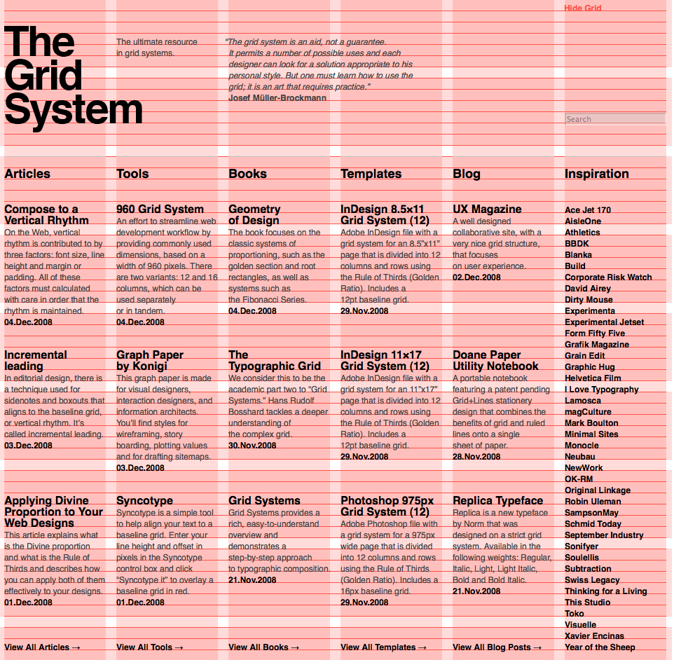
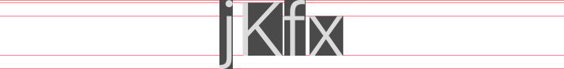
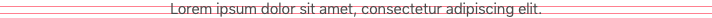
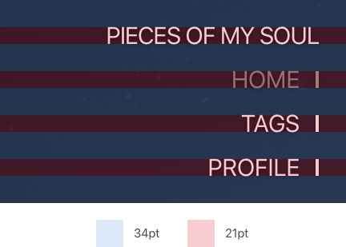
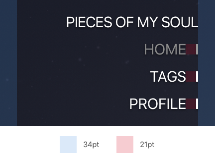
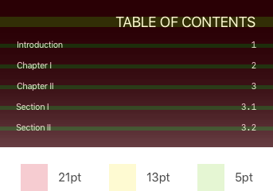
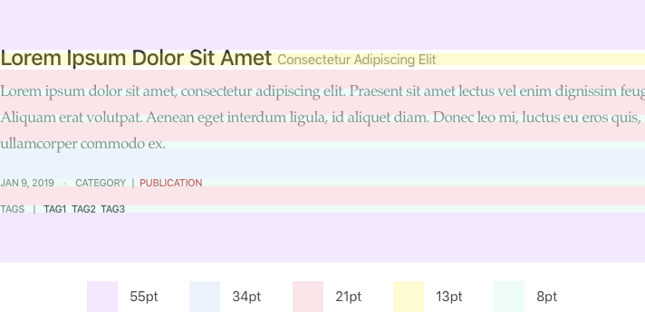
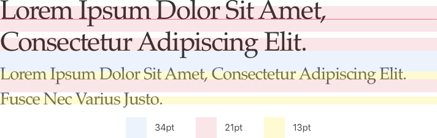

I didn't have much time to give a very modern design to the very first
version of Gatsblog. The deisgn is somehow "old school". But I tweaked the
grid system a lot to make this design to be a high quality design.

## Grid System

Grid system is a very common thing in most subfields of modern design
industry. It helps designers to lay things out in a certain rhythm.



But I didn't make use of those traditional grid systems like the above
figure shown.

## Typography

The most important thing of a blog is text. And text, strictly speaking
Latin characters, have a special rhythm other than regular geometries. 


Since there are not only height and width two metrics in Latin characters,
where doesn't like a rectangle or a square, laying out characters is more
complicated than laying out regular geometry. To laying out such
complicated geometries, we have to simplify them into following simple
rectangles.



You can find that the simplified geometry of letter "x" is much smaller
than that of letter capital "K". In fact, the differences between the
the sizes of simplified geometries of letters vary over different font
sizes. But how should we understand these size gaps?

The letter-frequency table below is taken from Pavel Mička's website[^1],
which cites Robert Lewand's *Cryptological Mathematics*.

| Letter | Relative Frequency in English Language (%) | 
|:------:|:------------------------------------------:|
| e	     | 12.02                                      |
| t	     | 9.10                                       |
| a	     | 8.12                                       |
| o	     | 7.68                                       |
| i	     | 7.31                                       |
| n	     | 6.95                                       |
| s	     | 6.28                                       |
| r	     | 6.02                                       |
| h	     | 5.92                                       |
| d	     | 4.32                                       |
| l	     | 3.98                                       |
| u	     | 2.88                                       |
| c	     | 2.71                                       |
| m	     | 2.61                                       |
| f	     | 2.30                                       |
| y	     | 2.11                                       |
| w	     | 2.09                                       |
| g	     | 2.03                                       |
| p	     | 1.82                                       |
| b	     | 1.49                                       |
| v	     | 1.11                                       |
| k	     | 0.69                                       |
| x	     | 0.17                                       |
| q	     | 0.11                                       |
| j	     | 0.10                                       |
| z	     | 0.07                                       |

The table didn't tell capital letters and small letters apart. But since
we only use capital letters at the beginning of a sentence, terminologies
and titles, telling capital letters and small letter apart would not
change the basic trend in this table.

By reading this table, for relative frequency of letters in English
language, we can know that 60.82% of it are small-cases-x-height-capped
(like "x") and 6.17% of it are small-cases-with-decent (like "j"), this
means for a given font with small enough font size, the descents,
`(ascents - x-height)` and `(cap-height - x-height)` come to be
negligible and the simplified geometries of characters in lines of a
paragraph are convergent to a rectangle whose height is the x-height. 



Thus we know that we could take the geometry of English text with regular
font of small enough size as a rectangle whose height is the x-height of
the font in practical design.

## Series

Series here means a set of quantities having the several values determined
by a common relation. Yes, it is the "series" in math.

When we talking about a grid system, we are actually talking about the
rhythm of sizes of elements and the rhythm of spaces between elements.
Such a rhythm shall have its beauty inside. The best choice is golden
ratio. But deriving sizes and spaces for a base value with golden ratio is
tedious. I choose Fibonacci series.

```
1, 1, 2, 3, 5, 8, 13, 21, 34, 55, 89, 144...
```

By removing the "1", "1", "2", "3" away, then we got a series makes sense
in practical design.

```
5, 8, 13, 21, 34, 55, 89, 144...
```

To simplify the number of Fibonacci numbers we used, we can just pick the
first 5 numbers.

```
5, 8, 13, 21, 34
```

And I used these 5 numbers in my design. All the sizes and spaces you see
on my blog are just one of these 5 numbers.







For Latin characters with big font sizes, the descent and the difference
between ascent and x-height or cap-height and x-height comes to be hard to
overlook as the font size increasing. For these cases, I still sizes the
font's x-height to match a particular series number. But the ascent and
cap-height cannot be ignored now.





[^1]: Mička, Pavel. ["Letter frequency (English)"](http://en.algoritmy.net/article/40379/Letter-frequency-English)
