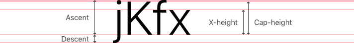

I'm gonna talk about the implementation of Gatsblog, which is a blog system
implemented with Gatsby.js, in this post. If you missed out previous posts about
the overview and design of Gatsblog and don't know the tech stack I'm talking
about, you can check the previous posts. Since Gatsblog is my first 
JavaScript-node-front-end project, I don't ensure the following contents are the
best practices.

## Distinguishing Resources

How to distinguish a post from others?

For there are posts may have the same name, we have to distinguish a post from
others. Like Jekyll, I chose a URL scheme like `/post/YYYY/MM/post-name` and
a file name scheme like `YYYY-MM-DDThh-mm-ssZ-post-name.md`(The time and
timezone is optional). Because the file name scheme may contain time
info ( `Thh-mm-ss` ) and timezone info ( `Z` ), soon it was found that you cannot
distinguish posts which were posted at the same day with the same post name in
this way.

Then I decided to **hash** the `YYYY-MM-DDThh-mm-ssZ` part and append the hash
value to the URL scheme. Thus the URL scheme turns out to be:

```
/post/YYYY/MM/post-name-1a0c
```

and we can distinguish each post now.

## Protects Sensitive Info from Bots

There are always some sensitive info on our site and we only want to give them
to real users but not bots. But plain HTML contents like
`mailto:whatever@email.ltd` expose your sensitive info to the bots. To prevent
bots from crawling our sensitive info, I designed an ad-hoc progress and
implemented a React component to do the things:

1. The blog system firstly encrypts sensitive info when compiling the sources.
2. Then the React component decrypts the sensitive info when the component was
clicked by a real user.

Implementing this is quite simple, the only trouble here is that Safari prevents
programmatically behavior changes like page redirection against clicking unless
you called `event.preventDefault()` right after a click event.

## Getting Used to CSS Layout Box

When implementing my design, I spotted that CSS layout box is not designed for
implementing efficiently with layout designs done by professional designers.

Someone probably would say: Wow, there are another layout models like flex-box
and grid in CSS.

Nope. I didn't mean the box model of CSS is not designed for implementing
efficiently with layout designs done by professional designers, but all the
layout models of css are not designed for that.

A CSS layout box in whatsoever layout model computes its content size of texts
with `line-height`. But `line-height` is not a native creature in designer's
world. A designer may be familiar with ascent, descent, x height, height and
even line spacing which are properties related to typography, but it would not
be familiar with `line-height`.



`line-height` in CSS sets the amount of space used for lines, such as in text.
This means `line-height` has nothing to do with the font's attributes. The only
way that you can connect `line-height` to font is to set it with pure
number (without unit) -- this makes the web browser's renderer to think there is
a ratio between `line-height` and `font-size`.


But as we showed in the previous post, a designer may lay things out with the
attributes of fonts. This makes that the default size of a layout box in CSS
may not work as what you expected.

To make a bridge connects CSS layout box and the designer's world, we need to
take the `line-height` into consideration when we setting up margins. In fact, I
developed a solution: Normalized Layout Box to shrink the layout box's size to
the designer purposed one.


### Normalized Layout Box

To shrink the layout box's size, we can make use of negative margin.

```css
.normalized-layout-box {
  font-size: 1.3em;
  line-height: 1.3;
  margin-top: -0.3rem;
  margin-bottom: -0.3rem;
}
```

But since `block` element collapses margins, which happens whenever an
element is next to another but also an element is nested to another, we
finally get `0` top margin if the layout box is the first child and `0`
bottom margin if the layout box is the last child. To make negative margin
to work for the case of being first and last child, we have to use a flex
box element to wrap the block elements.

```css
.normalized-layout-box-flex-wrapper {
  align-items: stretch;
  display: flex;
  flex-direction: column;
}
```

```html
<div class="normalized-layout-box-flex-wrapper">
  <div class="normalized-layout-box">
    Contents
  </div>
</div>
```

## Testing

This project is not a well tested project. Because testing in JavaScript
is very tedious or say, boring. Since JavaScript is a dynamic language,
we don't need to build explicit schemes for data types. This leads that
the correctness of code is seriously relied on testing. But since we don't
need to build explicit schemes for data types in the language, there are
also tons of works to do.

You might come up with "snapshot" -- which is a great feature in Jest. But
some issues are caused by mismatched types or other mistakes can be
eliminated by automatic language check. Thus those issues shall be
prevented from those automatic checks.

Moreover, how do you ensure your manually grabbed snapshot is correct?

I need a type system in JavaScript. Yes, I mean I need TypeScript and I
would transfer the development language from JavaScript to TypeScript if I
continued to upgrade this blog project.
