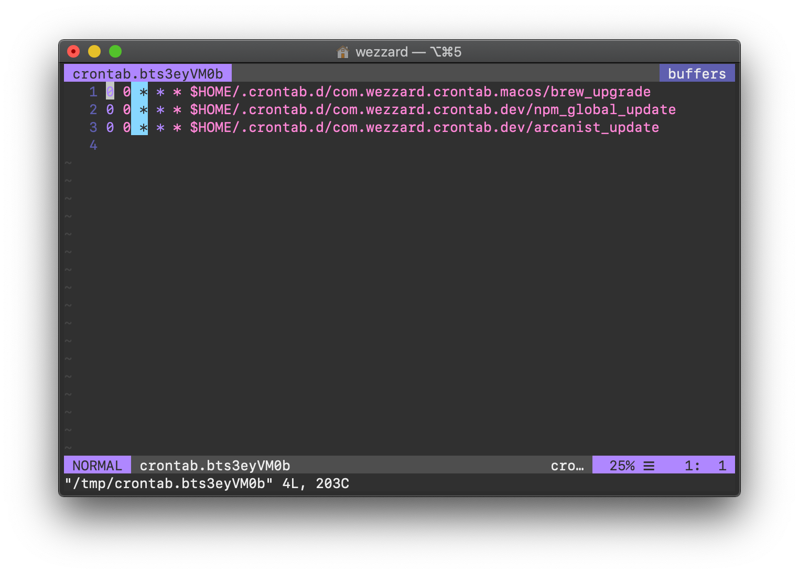
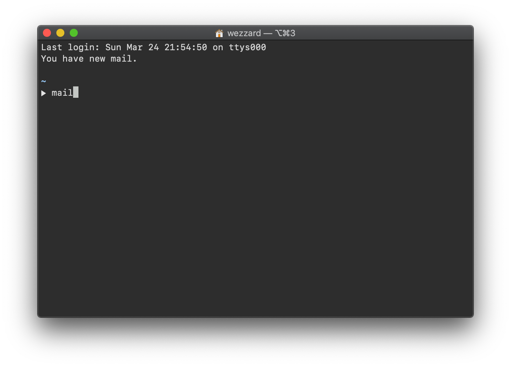
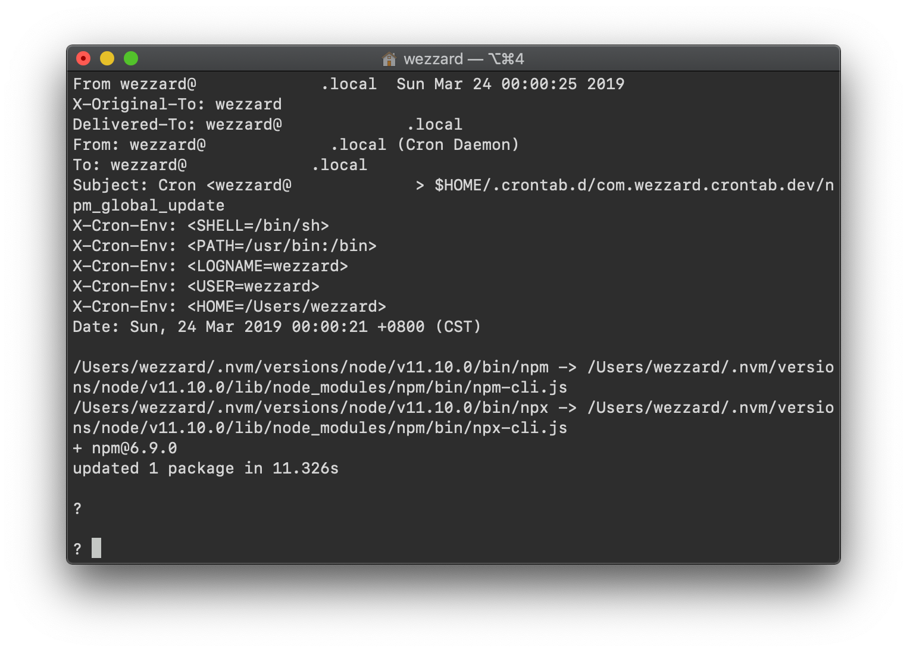
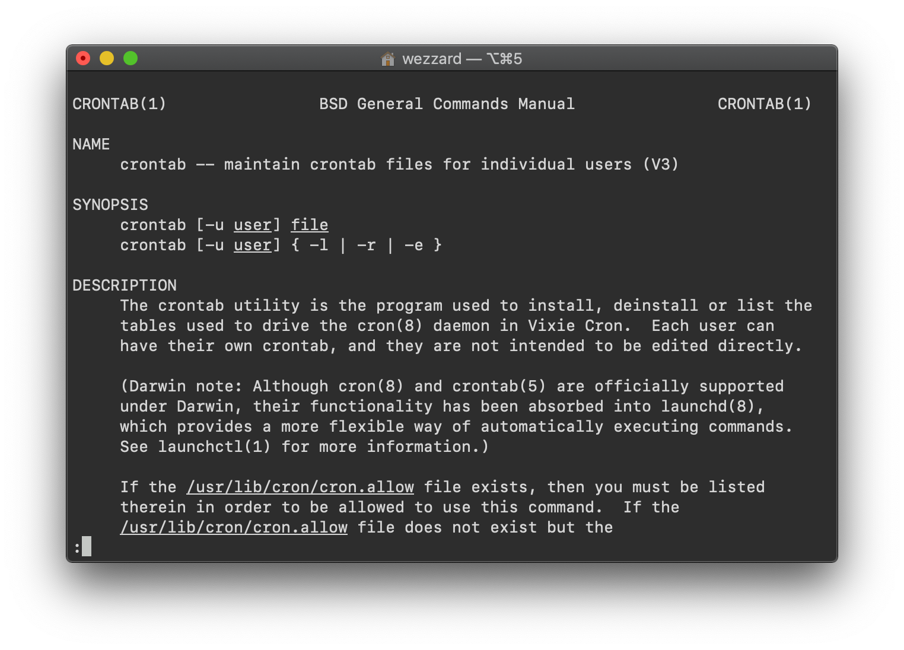

**crontab**, an abbreviation of chronic table (periodical time table), is
a task scheduler which schedules tasks in period of time on UNIX systems.
Each user in UNIX systems have its own "crontab".

## Editing the crontab File

By executing `crontab -e`, you can open the crontab of the user you logged
in. The following figure shows the contents of my crontab.



As you can see, I'm using crontab to automate the updates of **home brew**,
**npm** and **arcanist** (Arcanist is a CLI code review tool as a part of
the code review, project planning and hosting suite: Phabricator).

The left side sequences of numbers like `0 0 * * *` means "00:00 AM each
day", and sets the execution time of the right side command. You can have
a user-friendly tuning interface for this sequence of numbers at
[crontab.guru](https://crontab.guru).

The right side commands only supports several environment variables. You
can imagine a shell environment without any `*rc` file loaded, that is
what a crontab command gets.

Since a command executed by crontab gets such kind of shell environment,
even the `PATH` environment variable is not set yet, and you have to write
down the full path of a command.

A command executed by crontab can be a CLI command comes with the UNXI
system or a user script programmed by yourself. If you are executing a
system command which requires root privilege, you have to ensure the
command you are executing is listed in your sudoers file. If you are
executing a shell script in a crontab, you have to use
`chmod +x your_script_name` to make your script executable.

## Saving the crontab File

Saving your crontab file is different on different editors. In VIM, you
can save with `:w⏎`。 If you are using macOS, you may get a following
dialog after saving your crontab file and you have to click "OK" to allow
the system accept your editing.


## Notification Mails

Each time a command executed by crontab, you would get a mail. You can
check this mail in command line. You can use `mail` command to read these
mails.



Then each day you come to your desktop, just open your command line
terminal, and type `mail`, then you can know which CLI softwares were
updated. As you can see, the **npm** on my computer was updated today.



## Changing Notification Mails Destination

By default, each command executed by crontab sends a mail to the user who
sets the command up. But you can change the destination address by adding
the following line on the top of the crontab file (open crontab file by
typing `crontab -e`).

```crontab
MAILTO=your@emailaddress.com
``` 

You can also disable the mail notifications by setting `MAILTO` to `""`,
which like the following code shows:

```crontab
MAILTO=""
``` 

## Reading the Manual of crontab

By executing `man crontab`, you can see details of the usages of crontab.



## Some Resources

My crontab scripts for macOS: [WeZZard/com.wezzard.crontab.macos](https://github.com/WeZZard/com.wezzard.crontab.macos)

My crontab scripts for developing: [WeZZard/com.wezzard.crontab.dev](https://github.com/WeZZard/com.wezzard.crontab.dev)
