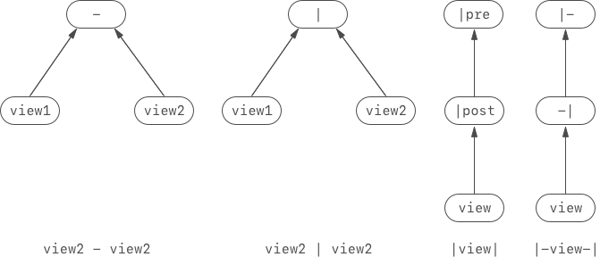
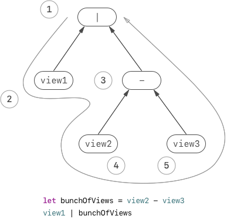
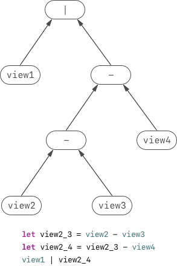
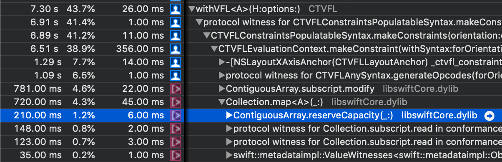
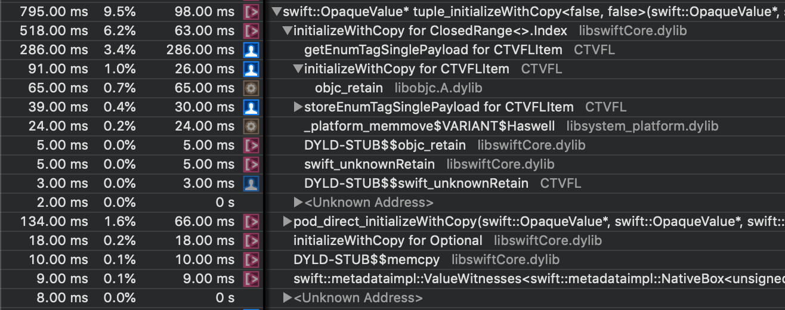
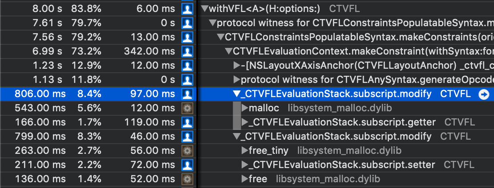
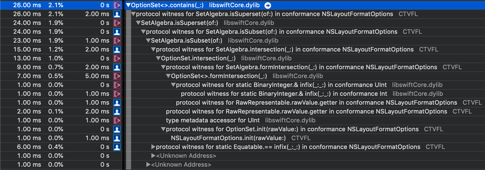
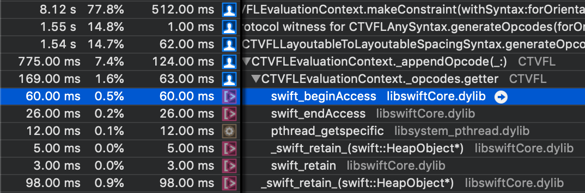

## Preface

What is the most critical thing swings your decision when you choose a
programming language?

Some people may say, the less lines of code they write, the better the
language itself is. (Nope, the best programming language is PHP.)

OK. It may be true. But writing less code is not a quantitative indicator
which results in the same outcome whenever, wherever. Depending on the
task you are focusing on, lines of code floats up and down as well.

I think a better way is to inspect what primitives the programming
language have.

For some old-school programming languages, they may not have
multi-dimensional array, which means an array cannot hold another one in
itself. This disallows developers to invent some recursive data structures
and limits the expressiveness of the language. The expressiveness of a
programming language, formally, is the **computational capability of a
programming language**.

But the array example I mentioned above is just about runtime computational
capability. What about the compile-time's?

Well. Languages like C++ which has an explicit compile progress and some
"code template" infrastructures hold an ability to do some compile-time
computations, which collects the pieces of the source code and then
organize them into a piece of new code. You may have heard a buzz word:
"meta-programming". Yes, this just is meta-programming (but at
compile-time) and this a bunch of programming languages includes C and
Swift.

Meta-programming in C++ relies on templates, and in C it relies on a
special header called `metamacros.h` in **libobjcext**. In Swift, it
relies on generics.

Though you can do compile-time meta-programming in these three programming
languages, the capability of them are different. Since there are a lot of 
posts talked about the reason why C++ template is **turing complete** (a
measurement of computational capability, you can just briefly treat it
as "can compute anything"), I don't want to waste my time on it. I'm gonna
talk about generic meta-programming in Swift and give a brief introduction
of `metamacros.h` in C. These two programming languages are weaker than
C++ in compile-time meta-programming. They are only able to implement a
**DFA** (deterministic-finite automaton, another measurement of
computational capacity. You can briefly treat it as "can compute things
with finite patterns") capped compile-time computational infrastructure.

--- 

## Case Study: Compile-Time-Ensured Safe VFL

There are a lot of Auto Layout helper libraries: Cartography, Mansory,
SnapKit... But, are they really good? What if there were a Swift versioned
VFL which ensures the correctness at compile-time and can collaborate with
Xcode's code completion?

Truth be told, I'm a fan of VFL. You can lay many views out by using one
line of code. With Cartography or SnapKit, things always go tedious.

Since the original VFL has some issues with modern iOS design, which
cannot cooperate with layout guides, you may also want layout guide
support in the API suite we are gonna implement.

Finally, in my production code, I built the following API which is
compile-time-ensured safe and supports layout guide.

```swift
// Make constraints and install to view hierarchy

constrain {
    withVFL(H: view1 - view2)
    
    withVFL(H: view.safeAreaLayoutGuide - view2)
    
    withVFL(H: |-view2)
}

// Just make constraints

let constraints1 = withVFL(V: view1 - view2)

let constraints2 = withVFL(V: view3 - view4, options: .alignAllCenterY)
```

Just imagine that how many lines of code you need for building equivalent
things with Cartography or SnapKit? Wanna know how did I build it?

Let me tell you.

### Transforming the Grammar

If we dump the original VFL grammar into Swift source code by trimming the
string literal quotes, then it will soon be find that some characters
used by the original VFL such as `[`, `]`, `@`, `(` and `)` is not allowed
in operator overloading in Swift source code. Thus I transformed the
original VFL grammar into the following grammar:

```swift
// Original VFL: @"|-[view1]-[view2]"
withVFL(H: |-view1 - view2)

// Original VFL: @"[view1(200@20)]"
withVFL(H: view1.where(200 ~ 20))

// Original VFL: @"V:[view1][view2]"
withVFL(V: view1 | view2)

// Original VFL: @"V:|[view1]-[view2]|"
withVFL(V: |view1 - view2|)

// Original VFL: @"V:|[view1]-(>=4@200)-[view2]|"
withVFL(V: |view1 - (>=4 ~ 200) - view2|)
```

### Figuring Out the Implementations

How to achieve this design?

An intuitive answer is to use operator overload.

Yes. I've done this with operator overload in my production code. But how
does the operator overloading work here? I mean, why the operator
overloading is able to convey our design?

Before answering the question above, let's check some examples out.

```swift
withVFL(H: |-view1 - view2 - 4)
```

The code above is an illegal input shall not be accepted. The relative 
original VFL is below:

```objectivec
@"|-[view1]-[view2]-4"
```

We can find that there is missing another view object, a `|` or a `-|`
after `4`.

We want our system to be able to handle correct input by making the
compiler to accept it and to be able to handle incorrect input by making
the compiler to reject it (because this is what **compile-time safe**
implies). The secrete behind it is not some black magic which applied by
an mystic engineer whom have got a "Senior SDE" title, but simply to
accept by matching user input with a defined function and to reject by
all defined functions mismatching the user input.

For example, like the `view1 - view2` in a part of the example above, we
can design the following function to handle it:

```swift
func - (lhs: UIView, rhs: UIView) -> BinarySyntax {
    // Do something really combine these two views togather.
}
```

If we take the `UIView` and `BinarySyntax` in the above code block as two
states, then we introduced state transitions into our system, and the
approach of state transitioning is operator overloading.

### Naïve State Transitioning

Knowing that by introducing state transitioning with operator overload 
may solve our problem, we may feel at a bit ease now.

But... How many types we are gonna create with this solution?

What you may not know is that, VFL is expressible by a DFA.

Yes. Since recursive texts like `[`, `]`, `(` and `)` are not really
recursive in VFL (only one level of them can appear in a correct VFL
input and cannot be nested), a DFA is able to express the complete
possible input set of VFL.

Thus I created a DFA to simulate the state transitions of **our design**.
Watch out! I didn't take layout guide into consideration in this figure.
Introducing layout guide may make the DFA much more complicated.

> To know more about recursiveness and DFA with a plain and brief
> introduction, you can check this book out:
> [Understanding Computation: From Simple Machines to Impossible Programs](http://shop.oreilly.com/product/0636920025481.do)


> In the diagram above, `|pre` means prefix `|` operator and respectively
> `|post` means postfix `|` operator, double circle means an accepting
> state and single circle means a receiving state. 

Counting the types we are gonna create is a complex task. Since there are
binary operators `|` and `-`, and there are unary operators `|-`, `-|`,
`|prefix` and `|postfix`, the counting method varies over these two kinds
of operators:

A binary operator consumes two transitions but an unary operator consumes
one. Each operator creates a new type.

Since even the counting method itself is too complex, I would rather to
explore another approach... 

### State Transitioning with Multiple States

I drew the DFA diagram above by deadly putting possible characters to test
whether a state receives them or not, this maps all the things into one
dimension. May be we can create a cleaner expression by abstract the
problem in multiple dimensions.

> Before the beginning of further exploration, we have to acquire some
> basic knowledge about Swift operator's associativity.
>
> The associativity of an operator (strictly speaking, of a binary
> operator, which mean an operator connects a left-hand-side operand and
> right-hand-side operand, just like `-`) is for which side of an
> operator, a compiler may prefer to use it for constructing syntax tree.
> The default associativity of Swift operator is left, which means the
> compiler prefer to use the left-hand-side of an operator to construct
> a syntax tree. Thus we can know for a left associative operator, it is
> visually left-leaning.

Firstly, let's write down some simplest syntaxes:

```swift
// Should accept
withVFL(H: view1 - view2)

// Should accept
withVFL(H: view1 | view2)

// Should accept
withVFL(H: |view1|)

// Should accept
withVFL(H: |-view1-|)
```

The syntax tree of them are below:



Then we can split the case into two:

- Binary syntaxes like `view1 - view2`, `view1 | view2`.

- Unary syntaxes like `|view1`, `view1-|`.

This makes us to intuitively create two types:

```swift
struct Binary<Lhs, Rhs> { ... }

func - <Lhs, Rhs>(lhs: Lhs, rhs: Rhs) -> Binary { ... }

func | <Lhs, Rhs>(lhs: Lhs, rhs: Rhs) -> Binary { ... }

struct Unary<Operand> { ... }

prefix func | <Operand>(operand: Operand) -> Unary { ... }

postfix func | <Operand>(operand: Operand) -> Unary { ... }

prefix func |- <Operand>(operand: Operand) -> Unary { ... }

postfix func -| <Operand>(operand: Operand) -> Unary { ... }
```

But is this enough?

#### Syntax Attribute

Soon it will be find that we can plug anything on the `Lhs` or `Rhs` of
`Binary`, or the `Operand` of `Unary`. We have to do some limitations.

Typically, inputs like `|-`, `-|`, `|prefix`, `|postfix` shall only be
appeared the at head and tail two sides of the syntax. Since we also want
to support layout guide (such as `safeAreaLayoutGuide`), which also should
only be appeared at the head and tail two sides of the syntax, we have to
constrain these stuffs are ensured only at the head and tail side of the
syntax.

```swift
|-view-|
|view|
```

Moreover, inputs like `4`, `>=40` shall only be appeared when paired with
preceding and succeeding view/superview or layout guide.

```swift
view - 4 - safeAreaLayoutGuide

view1 - (>=40) - view2
```

The above study of the syntax hinted us to split all things take
participant in the syntax into three groups: **layout'ed object** (views),
**confinement** (layout guides and things wrapped by `|-`, `-|`, `|prefix`
and `|postfix`),
and **constant**.

Now we are going to change our design into:

```swift
protocol Operand {
    associatedtype HeadAttribute: SyntaxAttribute
    
    associatedtype TailAttribute: SyntaxAttribute
}

protocol SyntaxAttribute {}

struct SyntaxAttributeLayoutedObject: SyntaxAttribute {}

struct SyntaxAttributeConfinment: SyntaxAttribute {}

struct SyntaxAttributeConstant: SyntaxAttribute {}
```

Then for specific combinations of syntaxes like `view1 - 4 - view2`, we
can make following syntax types. 

```swift
/// connects `view - 4`
struct LayoutableToConstantSpacedSyntax<Lhs: Operand, Rhs: Operand>: 
    Operand where 
    /// Checks the tail part of the lhs syntax is a layouted object
    Lhs.TailAttribute == SyntaxAttributeLayoutedObject,
    /// Checks the head part of the rhs syntax is a constant
    Rhs.HeadAttribute == SyntaxAttributeConstant
{
     typealias HeadAttribute = Lhs.HeadAttribute
     typealias TailAttribute = Lhs.TailAttribute
}

func - <Lhs, Rhs>(lhs: Lhs, rhs: Rhs) -> LayoutableToConstantSpacedSyntax<Lhs, Rhs> { ... }

/// connects `(view - 4) - view2`
struct ConstantToLayoutableSpacedSyntax<Lhs: Operand, Rhs: Operand>:
    Operand where
    /// Checks the head part of the lhs syntax is a constant
    Lhs.TailAttribute == SyntaxAttributeConstant,
    /// Checks the tail part of the rhs syntax is a layouted object
    Rhs.HeadAttribute == SyntaxAttributeLayoutedObject
{
     typealias HeadAttribute = Lhs.HeadAttribute
     typealias TailAttribute = Lhs.TailAttribute 
}

func - <Lhs, Rhs>(lhs: Lhs, rhs: Rhs) -> ConstantToLayoutableSpacedSyntax<Lhs, Rhs> { ... }
```

By conforming to the protocol `Operand`, a type indeed have got two
compile-time storage whose names are `HeadAttribute` and `TailAttribute`,
and values are of type of `SyntaxAttribute`. By calling the
function `-` (anyone in the above code block), the compiler checks if the
left-hand-side and right-hand-side matches any function with the name `-`
by reading generic constraints of the result
type (`ConstantToLayoutableSpacedSyntax` or
`LayoutableToConstantSpacedSyntax`). If it succeeded, we could say the
state has successfully transitioned to another.

We can see that, since we've set `HeadAttribute = Lhs.HeadAttribute` and
`TailAttribute = Lhs.TailAttribute` in the body of the types above, the
head and tail attribute of `Lhs` and `Rhs` is transferred from `Lhs` and
`Rhs` to the newly synthesized class now. The value is stored in the type
`HeadAttribute` and `TailAttribute`.

Then we've got our functions which make the compiler to receive input like
`view1 - 4 - view2`, `view1 - 10 - view2 - 19`... Wait! `view1 - 10 - view2 - 19`???
`view1 - 10 - view2 - 19` shall be an illegal input which may be rejected
by the compiler!

#### Syntax Boundaries

Actually, what we did above just have ensured that a view is consecutive
to a number and a number is consecutive is a view, it has nothing to do
with whether the syntax shall be beginning with a view (or layout guide)
and end with a view (or layout guide).

To make a syntax always begins or ends with a view, layout guide or things
like `|-`, `-|`, `|prefix` and `|postfix`, we have to build a logic to
help our types to **"filter"** those invalid input out, just like what we
did like `HeadAttribute = Lhs.HeadAttribute` and
`TailAttribute = Lhs.TailAttribute` above. We can find that there are
actually two groups of syntax mentioned in the example above:
**confinement** and **layout'ed object**. To make a syntax always begins
or ends with syntax in this two groups, we have to use compile-time `or`
logic to implemented it. Write it down in runtime code, it is:

```swift
if (lhs.tailAttribute == .isLayoutedObject || lhs.tailAttribute  == .isConfinment) &&
    (rhs.headAttribute == .isLayoutedObject || rhs.headAttribute == .isConfinment)
{ ... }
```
 
But this logic cannot be simply implemented with Swift in compile-time,
and the only logic of Swift compile-time computation is the `and` logic.
Since we can only use `and` logic in type constraints in Swift (by using
the `,` symbol between `Lhs.TailAttribute == SyntaxAttributeLayoutedObject`
and `Rhs.HeadAttribute == SyntaxAttributeConstant` in the example above),
we can only merge the
`(lhs.tailAttribute == .isLayoutedObject || lhs.tailAttribute  == .isConfinment)`
and `(rhs.headAttribute == .isLayoutedObject || rhs.headAttribute == .isConfinment)`
in the above code block into one compile-time storage value then use the
`and` logic to concatenate them.

Then we can change our design into:

```swift
protocol Operand {
    associatedtype HeadAttribute: SyntaxAttribute
    
    associatedtype TailAttribute: SyntaxAttribute
    
    associatedtype HeadBoundary: SyntaxBoundary
    
    associatedtype TailBoundary: SyntaxBoundary
}

protocol SyntaxBoundary {}

struct SyntaxBoundaryIsLayoutedObjectOrConfinment: SyntaxBoundary {}

struct SyntaxBoundaryIsConstant: SyntaxBoundary {}
```

This time, we added two new compile-time storage: `HeadBoundary` and
`TailBoundary`, and their values are of type of `SyntaxBoundary`. For view
or layout guide objects, they offer head and tail two boundaries of
`SyntaxBoundaryIsLayoutedObjectOrConfinment`. When calling the `-`
function, the a view or layout guide's boundary info transferred to the
newly synthesized type.

```swift
/// connects `view - 4`
struct LayoutableToConstantSpacedSyntax<Lhs: Operand, Rhs: Operand>: 
    Operand where 
    /// Checks the tail part of the lhs syntax is a layouted object
    Lhs.TailAttribute == SyntaxAttributeLayoutedObject,
    /// Checks the head part of the rhs syntax is a constant
    Rhs.HeadAttribute == SyntaxAttributeConstant
{
    typealias HeadBoundary = Lhs.HeadBoundary
    typealias TailBoundary = Rhs.TailBoundary
    typealias HeadAttribute = Lhs.HeadAttribute
    typealias TailAttribute = Lhs.TailAttribute
}

func - <Lhs, Rhs>(lhs: Lhs, rhs: Rhs) -> LayoutableToConstantSpacedSyntax<Lhs, Rhs> { ... }
```

Now, we just have to modify our `withVFL` series function's function
signature into:

```swift
func withVFL<O: Operand>(V: O) -> [NSLayoutConstraint] where
    O.HeadBoundary == SyntaxBoundaryIsLayoutedObjectOrConfinment,
    O.TailBoundary == SyntaxBoundaryIsLayoutedObjectOrConfinment
{ ... }
``` 

Then, only syntaxes whose boundaries are of layout guide or views can be
accept.

#### Syntax Associativity

But the concept of syntax boundaries still cannot help stop the compiler
from accepting inputs like `view1-| | view2` or `view2-| - view2`. This is
because that even the **boundaries** of a syntax is ensured, you cannot
ensure the inner part of the syntax is **associable**.

Thus we introduce the third pair of `associatedtype` in our design:

```swift
protocol Operand {
    associatedtype HeadAttribute: SyntaxAttribute
    
    associatedtype TailAttribute: SyntaxAttribute
    
    associatedtype HeadBoundary: SyntaxBoundary
    
    associatedtype TailBoundary: SyntaxBoundary
    
    associatedtype HeadAssociativity: SyntaxAssociativity
    
    associatedtype TailAssociativity: SyntaxAssociativity
}

protocol SyntaxAssociativity {}

struct SyntaxAssociativityIsOpen: SyntaxAssociativity {}

struct SyntaxAssociativityIsClosed: SyntaxAssociativity {}

```

For syntax like `|-`, `-|` or layout guide in a syntax, we can just
disable their associativity in new type's synthesize progress.

It this enough?

Yes. Actually, I'm cheating here. You may wonder that why I can quickly
spot issues by enumerating some examples and say yes to the question above
without any hesitation. The reason of that is that I've already enumerated
all the syntax tree constructions on paper. Planning on paper is a good
habit for being a good software engineer.

Now the core concept of the syntax tree's design is very close to my
production code. You can check it out on [WeZZard/CTVFL/CTVFL/Syntaxes](https://github.com/WeZZard/CTVFL/tree/master/CTVFL/Syntaxes).


### Generating NSLayoutConstraint Instances

OK. Come back. We still have something to be implemented, which is
critical to our whole work -- generate layout constraints.

Since the actual thing we get in the argument of `withVFL(V:)` function
series is a syntax tree, we can simply build an environment to evaluate
the syntax tree. 

> I'm trying to keep myself away from using buzz word, thus I was saying
> that "build an environment". But I cannot stop myself from telling you
> that we are going to build a **virtual machine** now.


By taking a look into a syntax tree, we can find that each level of the
syntax tree is whether an unary operator node, a binary operator node or
an operand node. We can abstract the computation of `NSLayoutConstraint`
into **small pieces** and ask these three kinds of node to populate the
**small pieces**. 

Sounds good. But how to do the abstraction? And how to design those
**small pieces**?

> For people whom have experience on designing a virtual machine or
> compiler constructions, they may know this is a problem related to
> "procedure abstraction" and "instruction set design". But I don't
> want to scare readers like you whom may not have enough knowledge about
> virtual machine or compiler constructions, thus I call them "abstract
> the computation of `NSLayoutConstraint`" and "small pieces" above.
> 
> One more reason of that I'm not talking with the term "procedure
> abstraction" and "instruction set design" is that "instruction set
> design" is the most frontend thing of the solution: you would get a
> thing call "opcode" (short for operation code. I don't know the reason
> why they shorten the term this way, but that's it.) later. But the
> "instruction set design" heavily affects the final form of "procedure
> abstraction" and you only can hardly derive the concept behind an
> instruction set without thinking about the "procedure abstraction"
> before doing "instruction set design".

#### Abstracting NSLayoutConstraint's Initialization

Since we are gonna support layout guide, the old fashion API

```swift
convenience init(
    item view1: Any, 
    attribute attr1: NSLayoutConstraint.Attribute, 
    relatedBy relation: NSLayoutConstraint.Relation, 
    toItem view2: Any?, 
    attribute attr2: NSLayoutConstraint.Attribute, 
    multiplier: CGFloat, 
    constant c: CGFloat
)
```

comes to be an unavailable option for us. You cannot get layout guide work
with this API. Yes, I've tried.

Then we may come up with layout anchors.

Yes. This works. My production code makes use of layout anchors. But why
layout anchors work?

In fact, we can check the documentations and know that the base class
of layout anchors `NSLayoutAnchor` has a group of API which generates
`NSLayoutConstraint` instance. If we can get all the arguments of this
group of API in deterministic steps, then we can abstract a formal model
for this computation progress.

Can we get all the arguments of this group of API in deterministic steps? 

The answer obviously is "yes".

#### A Glimpse into Syntax Tree Evaluation

In Swift, syntax trees are evaluated in depth-first traversal. The
following figure is the evaluation order of syntax `view1 - bunchOfViews`
in code block:

```swift
let bunchOfViews = view2 - view3
view1 | bunchOfViews
```



But even the root node is the first visited node in the whole evaluation
process, since it requires the evaluation result of its left-hand-side
child and right-hand-side child to complete the evaluation, it generates
`NSLayoutConstraint` instance at the last.

#### Abstract NSLayoutConstraint's Computation Procedure

By observing the figure of Swift syntax tree evaluation process above, we
can know that the node `view1` was evaluated at the second but the
evaluation result would be used at the last, thus we need a data structure
to store each node's evaluation result. You probably would come up with
stack. Yes, I'm using stack in my production code. But you shall know the
reason why we need a stack: a stack transfers a recursive structure into
linear, that is what we need. You may have already guessed that I'm gonna
use stack, but intuition doesn't work all the time.

With this stack, we have to put all the computational resource of
initializing an `NSLayoutConstraint` instance in it.

Moreover, we have to keep the stack to memorize the head and tail node of
the syntax tree that have been evaluated.

Why? Take a look at the following syntax tree:



 The syntax tree above was generated by the expression below:

```swift
let view2_3 = view2 - view3
let view2_4 = view2_3 - view4
view1 | view2_4
```

When we evaluating the node `-` at the second level of the tree (count
from the root), we have to pick view 3, which is the "inner" node of the
tree, to make an `NSLayoutConstraint` instance. Actually, generating
`NSLayoutConstraint` always needs to pick the "inner" nodes which with the
perspective of the node being evaluated. But for the root `|` node, 
the "inner" node soon comes to be `view1` and `view2`. Thus we have to
make the stack to memorize the head and tail node of the syntax tree that
have been evaluated.

#### About the "Return Value"

Yes, we have to design a mechanism to let each node of the syntax tree
to return the evaluation result.

I don't want to talk about how a real computer returns value over stack
frames, because it varies over different size of the data to be returned.
In Swift world, since all things all safe, which means the API that
bounding a piece of memory to be another "type" is difficult to access,
processing data with such a fragile rhythm is not a good choice (at least
for coding efficiency).

We just have to use a local variable in the evaluation context to keep
the stack's last pop result, then generate instructions to fetch data
from that variable, then we've done the design of the "return value"
system.

#### Building the VM

Once we completed the procedure abstraction, then the design of
instruction set just needs the last push.

In fact, we just have to let the instructions to do following things:

- Fetch views, layout guides, relations, constants and priorities.

- Generate the information about which anchor to pick.

- Make constraints.

- Pop and push the stack.

The complete production code is [here](https://github.com/WeZZard/CTVFL/blob/master/CTVFL/VM/CTVFLOpcode.swift)

### Assessment

We've done the whole concept and pseudo code of our compile-time safe VFL.

The question now is what do we gain with it?

#### For Our Compile-Time-Ensured Safe VFL

The advantage we got here is that the correctness the syntax is guaranteed.
Syntaxes like  `withVFL(H: 4 - view)` or `withVFL(H: view - |- 4 - view)`
would be rejected at compile time.

Then, we've got layout guide worked with our Swift implementation of VFL. 

Third, since we're executing instructions which generated by the syntax
trees organized at compile time, the total computation complexity is
`O(N)`, which `N` is the number of instructions a syntax generated. But
since the syntax trees are not constructed as compile-time, we have to
construct the syntax tree at runtime. The good news is that, in my
production code, the syntax tree's type is of `struct`, which means the
whole syntax tree is constructed on stack memory but not heap memory. 

In fact, after a whole day of optimizations, the performance of my
production code exceeded all the implementation of existing alternative
solutions (includes Cartography and SnapKit). I would place some
optimization tips at the end of this post.

#### For VFL

Theoretically, the original VFL has a bit more advantages on performance
over our design. VFL strings would actually be stored as C strings in the
executable file(Mach-O file)'s data segment, the operating system loads
them into the memory directly and there are no initializations shall be
done before using them. After loaded those VFL strings, the UI framework
of the targeted platform is ready for parsing the VFL string. Since VFL's
grammar is quite simple, building a parser works with time complexity of
`O(N)` is also quite simple. But I don't know the reason why VFL is the
slowest solution which helps developers to build Auto Layout constraints.

#### Benchmark

The following result is measured by building 10k constraints on iPhone X.


---

## Further Readings

### Swift Optimizations

#### Cost of Array

`Array` in Swift would spend a lot of time on checking whether its
internal storage is implemented by Objective-C or Swift. Using
`ContiguousArray` would make your code think Swift-ly in dedication. 

#### Cost of Collection.map

`Collection.map` in Swift is well optimized -- it reserves capacity before
appending elements, which eliminates allocating overhead.



But if you're mapping an array into a multi-dimensional array, and then
flatten it into a lower dimensional array, reserve the capacity at the
beginning and then using traditional `Array`'s `append(_:)` function is
a better choice.

#### Cost of Non-Nominal Types

Don't use non-nominal types (tuples) with writing scenes.



When writing non-nominal types, Swift needs to access the runtime to
ensure the code safety. This cost a lot of time. You should use a nominal
type, or say `struct` instead.

#### Cost of the subscript.modify Function

A `subscript`(`[key]` in `self[key]`) in Swift have three kinds of
potential paired functions:

- `getter`

- `setter`

- `modify`

What is `modify`?

Consider the following code:

```swift
struct StackLevel {
    var value: Int = 0
}

let stack: Array<StackLevel> = [.init()]

// accessing subscript.setter
stack[0] = StackLevel(value: 13)

// accessing subscript.modify
stack[0].value = 13
```

`subscript.modify` is a kind of function used for modifying a value of a
container's element. But it seems did a lot more than modifying a value.



I even don't know why there are `malloc` and `free` on my evaluation tree.

I replaced the evaluation stack from `Array` to my implementation, and
implemented a function named `modifyTopLevel(with:)` to modify the stack
top.

```swift
internal class _CTVFLEvaluationStack {
    internal var _buffer: UnsafeMutablePointer<_CTVFLEvaluationStackLevel>
    
    ...
    
    internal func modifyTopLevel(with closure: (inout _CTVFLEvaluationStackLevel) -> Void) {
        closure(&_buffer[_count - 1])
    }
}
```


#### Cost of OptionSet

The convenience of `OptionSet` is not free in Swift.

 

You can see that the `OptionSet` employs a very deep evaluation tree to
get a value which can be evaluated by manually bit masking. I don't know
if this phenomenon exists for release build, but I'm using manually bit
masking in my production code now.

#### Cost of Exclusivity Enforcement

Exclusivity enforcement also impacts on performance. You would see a lot
of `swift_beginAcces` and `swift_endAccess` in your evaluation tree. If
you are confident with your code, I suggest you to disable runtime
exclusivity enforcement. Search "exclusivity" in your build setting you
can find the option to turn it off.



### Compile-Time Computation of C

I also had implemented an interesting grammar in one of my [framework](https://github.com/WeZZard/ObjCDeepDynamic/wiki/Enrich-Auto-Synthesizable-%40dynamic-Property-Types)
which adds `@dynamic` property auto synthesizer with `metamacros.h`. The
example is below:

```objectivec
@ObjCDynamicPropertyGetter(id, WEAK) {
    // Do what you wanna do with a normal atomic weak Objective-C getter.
}

@ObjCDynamicPropertyGetter(id, COPY) {
    // Do what you wanna do with a normal atomic copy Objective-C getter.
}

@ObjCDynamicPropertyGetter(id, RETAIN, NONATOMIC) {
    // Do what you wanna do with a normal nonatomic retain Objective-C getter.
};
```

The implementation file is [here](https://github.com/WeZZard/ObjCDeepDynamic/blob/master/ObjCDeepDynamic/DynamicProperty/ObjCDynamicPropertySynthesizer.h).

`metamacros.h` is very useful scaffold to help C programmer to create
macros to ease brain burdens.

---

Thank for your reading of my long post. I lied in the title. This post is
totally not 
