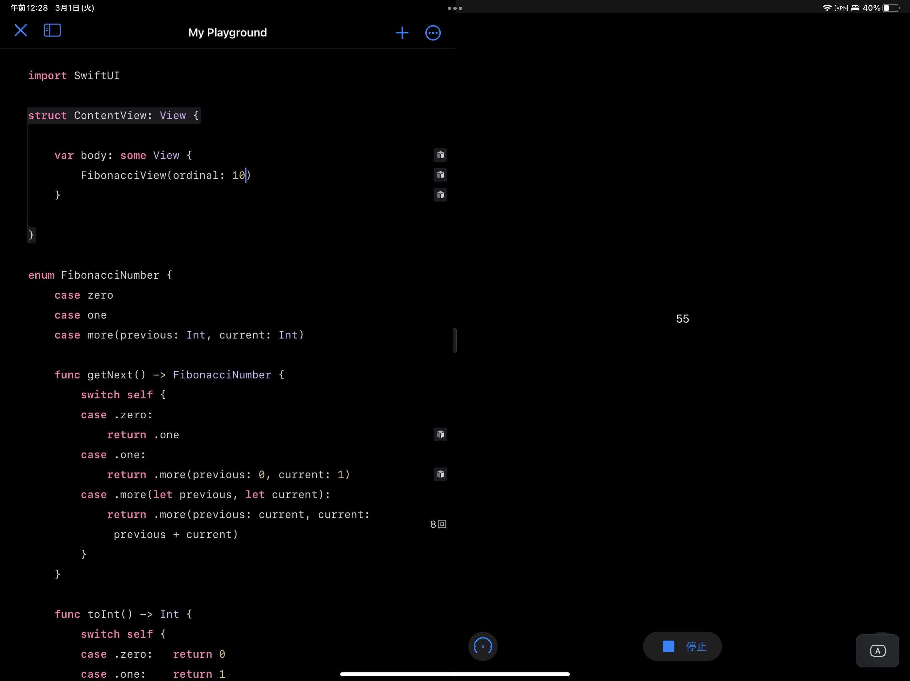
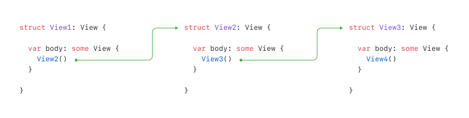

## Preface

Apple introduced SwiftUI at WWDC 2019. Most people may seem SwiftUI as yet another UI framework likes _Flutter_, _React.js_ or _Vue.js_ which rides on the trend of _declarative_ _stateless_ UI programming. Even though there are some common points between them, SwiftUI is far different from those UI frameworks I mentioned above from design to implementation.

In fact, SwiftUI is a programming language more than a UI framework. Don’t believe it? Let me show you an example which computes Fibonacci number with “native” SwiftUI code:

```swift
import SwiftUI

struct ContentView: View {
    
    var body: some View {
        Fibonacci(ordinal: 10)
    }
    
}

struct Fibonacci: View {
    
    var ordinal: Int
    
    private var value: Value

    init(ordinal: Int) {
        self.init(ordinal: ordinal, value: .zero)
    }

    private init(ordinal: Int, value: Value) {
        self.ordinal = ordinal
        self.value = value
    }
    
    var body: some View {
        if ordinal == 0 {
            Text("\(value)")
        } else {
            Fibonacci(ordinal: ordinal - 1, value: value.next())
        }
    }

    private enum Value: CustomStringConvertible {

        case zero

        case one

        case more(last: Int, current: Int)

        func next() -> Value {
            switch self {
            case .zero: return .one
            case .one:  return .more(last: 0, current: 1)
            case .more(let last, let current):
                return .more(last: current, current: last + current)
            }
        }

        var description: String {
            switch self {
            case .zero:                         return "0"
            case .one:                          return "1"
            case .more(let last, let current):  return "\(last + current)"
            }
        }

    }

}
```

By adding two lines of code, we can preview the code above in Swift Playground.

```swift
import PlaygroundSupport

PlaygroundPage.current.setLiveView(ContentView())
```



As you see, we computed Fibonacci number with “native” SwiftUI code. But being able to write a program which computes Fibonacci number with things come from SwiftUI does not mean that SwiftUI is a programming language. We can only say that it is programming language unless SwiftUI offers true “language structures” to make the program ran.

## Unexplained View Protocol

To understand the “language structure” of SwiftUI, we have to understand the unexplained part of `View` protocol firstly.

Basically, a `Veiw` protocol looks like below:

```swift
public protocol View {

    associatedtype Body: View

    @ViewBuilder
    var body: Body { get }

}
```

We can see that once a type conforms to `View` protocol, its instance has a `body` property which returns an instance whose type also conforms to `View` protocol. This leads an interesting phenomenon: if we get the `body` of a `View` instance then we can get the `body` of the `body` of this `View` instance. Since the `body` of the `body` of the `View` instance is also a `View` instance, thus we can continuously get its `body`. Theoretically, we can repeat this pattern infinitely.



Yes. You may have noticed that the design of `View` protocol is recursive. In fact, this recursive design of `View` protocol offers **the basic language structure** of SwiftUI which introduces a recursive-able execution pattern. SwiftUI’s internal mechanism can continually get the `body` of a `View` instance unless the recursion ended.

But when does the recursion end?

SwiftUI extends the `Never` type in Swift Standard Library to conform to `View` protocol. In this extension, `Never`’s  `body` also returns `Never`. Thus we can know that this is the recursion end.

```swift
extension Never: View { }

extension Never {

    public typealias Body = Never

    public var body: Never { get }

}
```

In SwiftUI’s internal implementation, once the `body` of a `View` instance is `Never` type, SwiftUI stops getting the `body` of the `View` instance and switch to the **built-in** logic of the view. If the **built-in** logic does not hand over the execution to other `View` instances, the recursion ends.

SwiftUI ships with a lot of `View` types whose `body` is `Never` type. Since this kind of `View` types have their own **built-in** logic, they are also called **built-in views**.

In the example of Fibonacci number I showed above, the recursion ends when the “program” of SwiftUI reaches the `Text` view in the `body` of `Fibonacci` — because the `Text` view’s `body` is `Never` type and the built-in logic of `Text` view would not hand over the execution to other `View` instances.

```swift
extension Text : View {

    public typealias Body = Never

}
```

## Other Language Structures

In previous descriptions, I narrowed the condition of the end of the recursion in SwiftUI’s execution pattern to be:

> A **built-in** view whose logic does not hand over the execution to other `View` instances

From this description, you may infer that there are built-in views in SwiftUI which hand over execution to other `View` instances. And yes, there are.

To help understand the language structures offered by SwiftUI in the Fibonacci number example I shown above, I would introduce one of them here — the language structure brought by `if...else...` statement in the `body` of `Fibonacci` — `_ConditionalContent`.

```swift
struct Fibonacci: View {

    var body: some View {
        // The `if...else...` statement
        // would finally generates a
        // `_ConditionalContent` instance
        if ordinal == 0 {
            // ...
        } else {
            // ...
        }
    }

}
```

`_ConditionalContent` is not exposed in SwiftUI’s public documentation. But we can find it in SwiftUI’s `swiftinterface` file.

```swift
public struct _ConditionalContent<TrueContent, FalseContent> {

  internal enum Storage {
    case trueContent(TrueContent)
    case falseContent(FalseContent)
  }

  internal let storage: Storage

}

extension ConditionalContent : View where TrueContent : View, FalseContent : View {

  public typealias Body = Never

  internal init(storage: Storage)

}
```

> `swiftinterface` file to a Swift module is just like header files to a clang module.

At the same time, there is an extension for SwiftUI’s `ViewBuilder` which shows when we using `if...else...` statements in a `@ViewBuilder` marked-up function, the Swift compiler would generate codes which warp branches of `if...else...` statement into a `_ConditionalContent` at compile-time: when the expression after `if` evaluated into `true`, the generated code invokes first `buildEither` function; when the expression evaluated into `false`, the generated code invokes the second `buildEither` function.

```swift
extension ViewBuilder {

  public static func buildEither<TrueContent : View, FalseContent : View>(first: TrueContent) -> ConditionalContent<TrueContent, FalseContent> {
    .init(storage: .trueContent(first))
  }

  public static func buildEither<TrueContent : View, FalseContent : View>(second: FalseContent) -> ConditionalContent<TrueContent, FalseContent> {
   .init(storage: .falseContent(second))
  }

}
```

By combining what we found in `ViewBuilder` extension and the design of `_ConditionalContent`, we can infer that a `_ConditionalContent` instance is able to carry two kinds of instance — one refers to the content under `true` branch of the `if...else..` statement and the other refers to the content under `false` branch.

For example, in the Fibonacci number example, when the expression after `if` evaluated into `true`, the `body` of `Fibonacci` equals to the following code:

```swift
struct Fibonacci: View {

    var body: some View {
        _ConditionalContent(storage: .trueContent(Text("\(value)")))
    }

}
```

when the expression evaluated into `false`, the `body` of `Fibonacci` equals to the following code:

```swift
struct Fibonacci: View {

    var body: some View {
        _ConditionalContent(storage: .falseContent(Fibonacci(...)))
    }

}
```

**And the built-in logic of `_ConditionContent` would finally hand over the `View` instance stored in its `storage`.**

Thus we can know that unless the `ordianal` of `Fibonacci` is equal to `0`, the `Fibonacci`’s `body` always recursively generates another `Fibonacci`. And when the `ordinal` of `Fibonacci` is equal to `0`, the `Fibonacci`’s `body` generates a `Text` view which renders the output value of `Fibonacci`.

## Conclusion

With previous analysis, we can clearly know that SwiftUI does offer the critical language structures for the execution in the example of computing Fibonacci number above — which include:

- The View protocol which introduces recursive-able execution pattern.
- A View protocol conformed type: _ConditionalContent which enables conditional branching.

which is quite like a real programming language. Thus we can say that SwiftUI is a programming language more than a UI framework.

## A Formal Perspective

Actually, the Fibonacci example show that SwiftUI is Turing complete language: if a procedure can re-enter itself, and the procedure itself can change its behavior infinitely, then the language behind the procedure is Turing complete.
