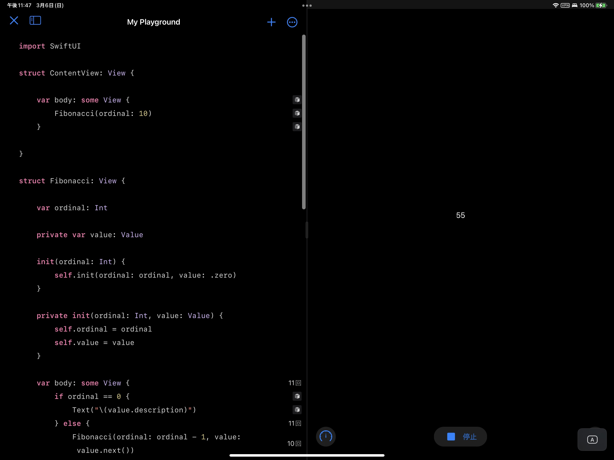
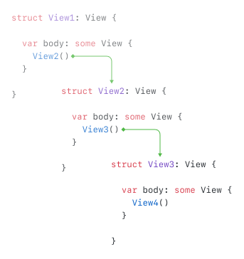

## 前言

苹果在 WWDC 2019 向开发者介绍了 SwiftUI。多数人也许会将 SwiftUI 看成又一个如 _Flutter_ 或者 _React.js_ 又或者 _Vue.js_ 这样踩在声明式、无状态 UI 编程潮流浪尖的 UI 框架。虽然 SwiftUI 与上述框架有着非常多的共同点，但是 SwiftUI 从设计到实现上都与上述框架有着本质的不同。

实际上，相较于是一个编程框架，SwiftUI 更加像是一种编程语言。不相信？让我来看看一个用「原生」SwiftUI 代码编写的斐波那契数列计算程序。

```swift
import SwiftUI

struct ContentView: View {

    var body: some View {
        Fibonacci(ordinal: 10)
    }

}

struct Fibonacci: View {

    var ordinal: Int

    private var value: Value

    init(ordinal: Int) {
        self.init(ordinal: ordinal, value: .zero)
    }

    private init(ordinal: Int, value: Value) {
        self.ordinal = ordinal
        self.value = value
    }

    var body: some View {
        if ordinal == 0 {
            Text("\(value.description)")
        } else {
            Fibonacci(ordinal: ordinal - 1, value: value.next())
        }
    }

    private enum Value: CustomStringConvertible {

        case zero

        case one

        case more(last: Int, current: Int)

        func next() -> Value {
            switch self {
            case .zero: return .one
            case .one:  return .more(last: 0, current: 1)
            case .more(let last, let current):
                return .more(last: current, current: last + current)
            }
        }

        var description: String {
            switch self {
            case .zero:                         return "0"
            case .one:                          return "1"
            case .more(let last, let current):  return "\(last + current)"
            }
        }

    }

}
```

然后通过添加以下两行代码，我们可以在 Swift Playground 预览上面的代码。

```swift
import PlaygroundSupport

PlaygroundPage.current.setLiveView(ContentView())
```



如你所见，我们使用「原生」 SwiftUI 代码计算出了斐波那契数列。但是可以使用来自 SwiftUI 的东西写出一个程序并不意味着 SwiftUI 是一门编程语言。只有当 SwiftUI 为这个程序提供了真正的「语言结构」时，我们才能说 SwiftUI 是一门编程语言。

## View 协议中未被解释的部分

要理解 SwiftUI 的语言结构，我们必须首先理解 `View` 协议中没有被解释过的部分。

基本上，`View` 协议会如下所示：

```swift
public protocol View {

    associatedtype Body: View

    @ViewBuilder
    var body: Body { get }

}
```

我们可以看到，一旦一个类型遵从了 `View` 协议，它的实例将拥有一个 `body` 属性。同时这个 `body` 属性也将返回一个遵从 `View` 协议的实例。这将导致一个有趣的现象：如果我们获得了一个 `View` 实例的 `body`，那么我们将又能获得这个 `View` 实例 `body` 的 `body`。因为 `View` 实例 `body` 的 `body` 也是一个 `View` 实例，所以我们可以继续获得它的 `body`。理论上，我们可以无限重复这个模式。



是的。你也许已经意识到了 `View` 协议的设计是递归的。实际上，这个递归的设计提供了 SwiftUI 的基本语言结构。而这个基本语言结构引入了一种可以递归的执行模式。SwiftUI 的内部机制可以持连不断地续获得 `View` 实例的 `body` 直到递归结束。

但是什么时候递归结束呢？

SwiftUI 扩展了标准库中的 `Never` 类型以遵从 `View` 协议。在这个扩展中，`Never` 的 `body` 同时会返回 `Never`。所以我们可以知道这就是递归的终点。

```swift
extension Never: View { }

extension Never {

    public typealias Body = Never

    public var body: Never { get }

}
```

在 SwiftUI 的内部实现中，一旦一个 `View` 实例的 `body` 是 `Never` 类型的，SwiftUI 将停止获取这个 `View` 实例的 `body`，转而切换到这个视图的**内建**逻辑。如果这个视图的**内建**逻辑不会将执行转交给其他 `View` 实例，那么递归将终止。

SwiftUI 带来了很多 `body` 是 `Never` 类型的 `View` 类型。由于这类 `View` 类型拥有其**内建**的逻辑，他们也被成为**内建视图**。

在我上面展示的斐波那契数列的例子中， 因为 `Text` 的 `body` 是 `Never` 类型的，同时 `Text` 的内建逻辑不会将程序执行转交给其他实例，程序的递归将终止在 SwiftUI 执行到 Fibonacci `body` 中的 `Text` 视图时。

```swift
extension Text : View {

    public typealias Body = Never

}
```

## 其他语言结构

在前面的描述中，我将 SwiftUI 执行模式中递归结束的条件限缩到了：

> 一个不会将程序执行转交给其他 `View` 实例的**内建**视图

从这个描述中你也许可以推断，SwiftUI 中存在内建视图会将程序执行逻辑转交给其他 `View` 实例。没错，确实如此。

在这里我将介绍其中的一个以帮助大家理解上面斐波那契数列范例中 SwiftUI 所提供的语言结构：`Fibonacci` `body` 中 `if..else...` 语句背后的语言结构 —— `_ConditionalContent`。

```swift
struct Fibonacci: View {

    var body: some View {
        // `if...else...` 语句将最终声称一个 
        // `_ConditionalContent` 实例
        if ordinal == 0 {
            // ...
        } else {
            // ...
        }
    }

}
```

`_ConditionalContent` 并没有在苹果的公开文档中暴露出来. 但是我们可以在 SwiftUI 的 `swiftinterface` 文件中找到它：

```swift
public struct _ConditionalContent<TrueContent, FalseContent> {

  internal enum Storage {
    case trueContent(TrueContent)
    case falseContent(FalseContent)
  }

  internal let storage: Storage

}

extension ConditionalContent : View where TrueContent : View, FalseContent : View {

  public typealias Body = Never

  internal init(storage: Storage)

}
```

> `swiftinterface` 文件之于 Swift module 就像头文件之于 clang module。

同时，SwiftUI 的 `ViewBuilder` 拥有一个 `extension`。里面的内容告诉我们，当我们在一个被 `@ViewBuiler` 标记的函数内使用 `if...else...` 语句时，Swift 编译器将会在编译时生成一个 `_ConditionalContent` 实例来包裹 `if...else...` 两侧分支内的内容 —— 当 `if` 后的表达式为 `true` 的时候，生成代码唤起第一个 `buildEither` 函数；为 `false` 时，生成代码唤起第二个 `buildEither` 函数。

```swift
extension ViewBuilder {

  public static func buildEither<TrueContent : View, FalseContent : View>(first: TrueContent) -> ConditionalContent<TrueContent, FalseContent> {
    .init(storage: .trueContent(first))
  }

  public static func buildEither<TrueContent : View, FalseContent : View>(second: FalseContent) -> ConditionalContent<TrueContent, FalseContent> {
   .init(storage: .falseContent(second))
  }

}
```

通过将我们在 `ViewBuilder` `extension` 中所发现的以及 `_ConditionalContent` 本身的设计相结合，我们而可以推导出 `_ConditionalContent` 能够携带两种实例 —— 一种是 `if...else` 的 `ture` 分支下的内容，一种是 `false` 分支下的内容。

举个例子，在斐波那契数列范例中，当 `if` 之后的表达式为 `true` 时，`Fibonacci` 的 `body` 等于如下代码：

```swift
struct Fibonacci: View {

    var body: some View {
        _ConditionalContent(storage: .trueContent(Text(...)))
    }

}
```

当表达式为 `false` 时，`Fibonacci` 的 `body` 等于如下代码：

```swift
struct Fibonacci: View {

    var body: some View {
        _ConditionalContent(storage: .falseContent(Fibonacci(...)))
    }

}
```

**然后 `_ConditionContent` 的内建逻辑最终会将程序执行转交给它 `storage` 中存储的 `View` 实例**

所以我们可以知道，除非 `Fibonacci` 的 `ordinal` 为 `0`，`Fibonacci` 的 `body` 将永远递归地生成另一个 `Fibonacci`。然后当 `Fibonacci` 的 `ordinal` 为 `0` 时，`Fibonacci` 的 `body` 将生成一个 `Text` 视图以渲染 `Fibonacci` 的最终输出结果。

## 结论

通过之前的分析，我们可以清楚地知道 SwiftUI 确实为上述斐波那契数列范例的执行过程提供了关键的语言结构，他们包括：

- 一个带来可递归执行模式的 `View` 协议。
- 一个遵从 `View` 协议的类型 `_ConditionalContent`。它负责处理条件分支。

这就很像一门真实的编程语言了。所以我们可以说相较是一个 UI 框架，SwiftUI 更像是一门语言。

## 一个形式化的视角

实际上，这个斐波那契数列的范例展现了 SwiftUI 是图灵完备的：如果一个过程可以重新进入它自己，并且这个过程可以无限改变它的行为，那么这个过程背后的语言就是图灵完备的。
