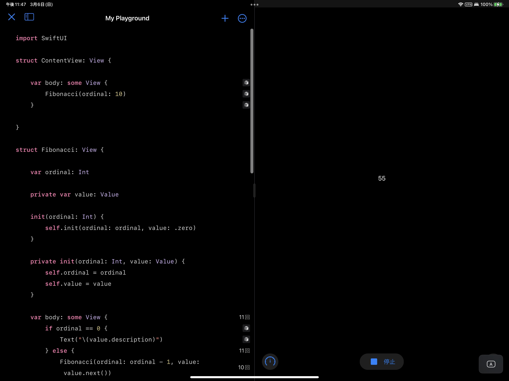
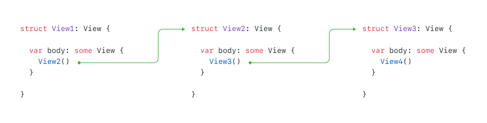

## 前言

蘋果在 WWDC 2019 向開發者介紹了 SwiftUI。多數人也許會將 SwiftUI 看成又一個如 _Flutter_ 或者 _React.js_ 又或者 _Vue.js_ 這樣踩在聲明式、無狀態 UI 編程潮流浪尖的 UI 框架。雖然 SwiftUI 與上述框架有着非常多的共同點，但是 SwiftUI 從設計到實現上都與上述框架有着本質的不同。

實際上，相較於是一個編程框架，SwiftUI 更加像是一種編程語言。不相信？讓我來看看一個用「原生」SwiftUI 代碼編寫的斐波那契数列計算程序。

```swift
import SwiftUI

struct ContentView: View {

    var body: some View {
        Fibonacci(ordinal: 10)
    }

}

struct Fibonacci: View {

    var ordinal: Int

    private var value: Value

    init(ordinal: Int) {
        self.init(ordinal: ordinal, value: .zero)
    }

    private init(ordinal: Int, value: Value) {
        self.ordinal = ordinal
        self.value = value
    }

    var body: some View {
        if ordinal == 0 {
            Text("\(value.description)")
        } else {
            Fibonacci(ordinal: ordinal - 1, value: value.next())
        }
    }

    private enum Value: CustomStringConvertible {

        case zero

        case one

        case more(last: Int, current: Int)

        func next() -> Value {
            switch self {
            case .zero: return .one
            case .one:  return .more(last: 0, current: 1)
            case .more(let last, let current):
                return .more(last: current, current: last + current)
            }
        }

        var description: String {
            switch self {
            case .zero:                         return "0"
            case .one:                          return "1"
            case .more(let last, let current):  return "\(last + current)"
            }
        }

    }

}
```

然後通過添加以下兩行代碼，我們可以在 Swift Playground 預覽上面的代碼。

```swift
import PlaygroundSupport

PlaygroundPage.current.setLiveView(ContentView())
```



如你所見，我們使用「原生」 SwiftUI 代碼計算出了斐波那契数列。但是可以使用來自 SwiftUI 的東西寫出一個程序並不意味着 SwiftUI 是一門編程語言。只有當 SwiftUI 爲這個程序提供了真正的「語言結構」時，我們才能說 SwiftUI 是一門編程語言。

## View 協議中未被解釋的部分

要理解 SwiftUI 的語言結構，我們必須首先理解 `View` 協議中沒有被解釋過的部分。

基本上，`View` 協議會如下所示：

```swift
public protocol View {

    associatedtype Body: View

    @ViewBuilder
    var body: Body { get }

}
```

我們可以看到，一旦一個類型遵從了 `View` 協議，它的實例將擁有一個 `body` 屬性。同時這個 `body` 屬性也將返回一個遵從 `View` 協議的實例。這將導致一個有趣的現象：如果我們獲得了一個 `View` 實例的 `body`，那麼我們將又能獲得這個 `View` 實例 `body` 的 `body`。因爲 `View` 實例 `body` 的 `body` 也是一個 `View` 實例，所以我們可以繼續獲得它的 `body`。理論上，我們可以無限重複這個模式。



是的。你也許已經意識到了 `View` 協議的設計是遞歸的。實際上，這個遞歸的設計提供了 SwiftUI 的基本語言結構。而這個基本語言結構引入了一種可以遞歸的執行模式。SwiftUI 的內部機制可以持連不斷地續獲得 `View` 實例的 `body` 直到遞歸結束。

但是什麼時候遞歸結束呢？

SwiftUI 擴展了標準庫中的 `Never` 類型以遵從 `View` 協議。在這個擴展中，`Never` 的 `body` 同時會返回 `Never`。所以我們可以知道這就是遞歸的終點。

```swift
extension Never: View { }

extension Never {

    public typealias Body = Never

    public var body: Never { get }

}
```

在 SwiftUI 的內部實現中，一旦一個 `View` 實例的 `body` 是 `Never` 類型的，SwiftUI 將停止獲取這個 `View` 實例的 `body`，轉而切換到這個視圖的**內建**邏輯。如果這個視圖的**內建**邏輯不會將執行轉交給其他 `View` 實例，那麼遞歸將終止。

SwiftUI 帶來了很多 `body` 是 `Never` 類型的 `View` 類型。由於這類 `View` 類型擁有其**內建**的邏輯，他們也被成爲**內建視圖**。

在我上面展示的斐波那契数列的例子中， 因爲 `Text` 的 `body` 是 `Never` 類型的，同時 `Text` 的內建邏輯不會將程序執行轉交給其他實例，程序的遞歸將終止在 SwiftUI 執行到 Fibonacci `body` 中的 `Text` 視圖時。

```swift
extension Text : View {

    public typealias Body = Never

}
```

## 其他語言結構

在前面的描述中，我將 SwiftUI 執行模式中遞歸結束的條件限縮到了：

> 一個不會將程序執行轉交給其他 `View` 實例的**內建**視圖

從這個描述中你也許可以推斷，SwiftUI 中存在內建視圖會將程序執行邏輯轉交給其他 `View` 實例。沒錯，確實如此。

在這裏我將介紹其中的一個以幫助大家理解上面斐波那契数列範例中 SwiftUI 所提供的語言結構：`Fibonacci` `body` 中 `if..else...` 語句背後的語言結構 —— `_ConditionalContent`。

```swift
struct Fibonacci: View {

    var body: some View {
        // `if...else...` 語句將最終聲稱一個 
        // `_ConditionalContent` 實例
        if ordinal == 0 {
            // ...
        } else {
            // ...
        }
    }

}
```

`_ConditionalContent` 並沒有在蘋果的公開文檔中暴露出來. 但是我們可以在 SwiftUI 的 `swiftinterface` 文件中找到它：

```swift
public struct _ConditionalContent<TrueContent, FalseContent> {

  internal enum Storage {
    case trueContent(TrueContent)
    case falseContent(FalseContent)
  }

  internal let storage: Storage

}

extension ConditionalContent : View where TrueContent : View, FalseContent : View {

  public typealias Body = Never

  internal init(storage: Storage)

}
```

> `swiftinterface` 文件之於 Swift module 就像頭文件之於 clang module。

同時，SwiftUI 的 `ViewBuilder` 擁有一個 `extension`。裏面的內容告訴我們，當我們在一個被 `@ViewBuiler` 標記的函數內使用 `if...else...` 語句時，Swift 編譯器將會在編譯時生成一個 `_ConditionalContent` 實例來包裹 `if...else...` 兩側分支內的內容 —— 當 `if` 後的表達式爲 `true` 的時候，生成代碼喚起第一個 `buildEither` 函數；爲 `false` 時，生成代碼喚起第二個 `buildEither` 函數。

```swift
extension ViewBuilder {

  public static func buildEither<TrueContent : View, FalseContent : View>(first: TrueContent) -> ConditionalContent<TrueContent, FalseContent> {
    .init(storage: .trueContent(first))
  }

  public static func buildEither<TrueContent : View, FalseContent : View>(second: FalseContent) -> ConditionalContent<TrueContent, FalseContent> {
   .init(storage: .falseContent(second))
  }

}
```

通過將我們在 `ViewBuilder` `extension` 中所發現的以及 `_ConditionalContent` 本身的設計相結合，我們而可以推導出 `_ConditionalContent` 能夠攜帶兩種實例 —— 一種是 `if...else` 的 `ture` 分支下的內容，一種是 `false` 分支下的內容。

舉個例子，在斐波那契数列範例中，當 `if` 之後的表達式爲 `true` 時，`Fibonacci` 的 `body` 等於如下代碼：

```swift
struct Fibonacci: View {

    var body: some View {
        _ConditionalContent(storage: .trueContent(Text(...)))
    }

}
```

當表達式爲 `false` 時，`Fibonacci` 的 `body` 等於如下代碼：

```swift
struct Fibonacci: View {

    var body: some View {
        _ConditionalContent(storage: .falseContent(Fibonacci(...)))
    }

}
```

**然後 `_ConditionContent` 的內建邏輯最終會將程序執行轉交給它 `storage` 中存儲的 `View` 實例**

所以我們可以知道，除非 `Fibonacci` 的 `ordinal` 爲 `0`，`Fibonacci` 的 `body` 將永遠遞歸地生成另一個 `Fibonacci`。然後當 `Fibonacci` 的 `ordinal` 爲 `0` 時，`Fibonacci` 的 `body` 將生成一個 `Text` 視圖以渲染 `Fibonacci` 的最終輸出結果。

## 結論

通過之前的分析，我們可以清楚地知道 SwiftUI 確實爲上述斐波那契数列範例的執行過程提供了關鍵的語言結構，他們包括：

- 一個帶來可遞歸執行模式的 `View` 協議。
- 一個遵從 `View` 協議的類型 `_ConditionalContent`。它負責處理條件分支。

這就很像一門真實的編程語言了。所以我們可以說相較是一個 UI 框架，SwiftUI 更像是一門語言。

## 一個形式化的視角

實際上，這個斐波那契数列的範例展現了 SwiftUI 是圖靈完備的：如果一個過程可以重新進入它自己，並且這個過程可以無限改變它的行爲，那麼這個過程背後的語言就是圖靈完備的。
