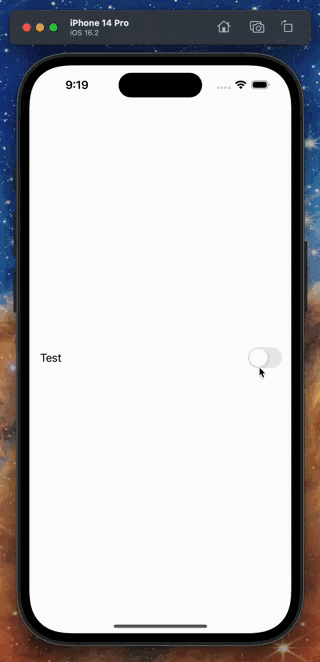
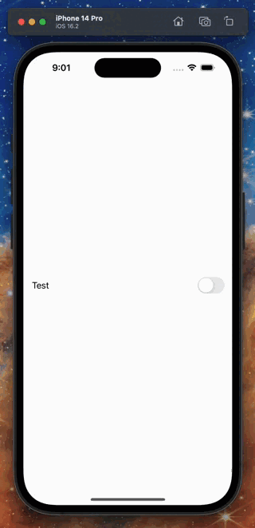
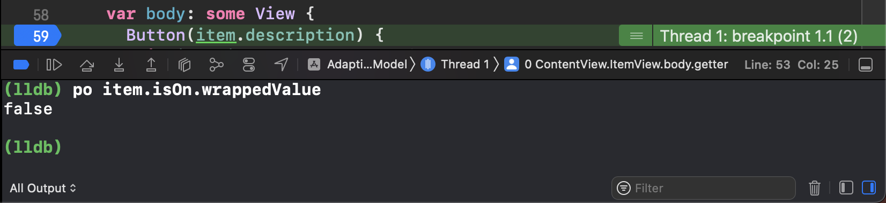
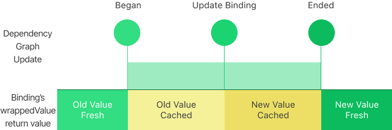

## Introduction

Recently, one of my colleagues had been struggling with porting reference semantics model to SwiftUI with `ObservableObject` and `@StateObject`. In this post, since there are many examples talked about porting reference semantics models to SwiftUI this way on the Internet, I'm not going to focus on the basic situation of this method. Instead, three more valuable topics can be spotted in the efforts made by my colleague and me in the process of searching for solutions to get his code to work. These topics are:

- What is the source of truth in SwiftUI?
- How to correctly compose a source of truth in SwiftUI?
- How to deal with asynchronous methods which are commonly used in reference semantics world when composing a source of truth.

The mixture of misunderstanding towards these three topics is the reason that made my colleague cornered himself for over one day. I'm going to show these three topics one by one in the following story.

## The Initial Problem

My colleague wants to implement a switch that requires user confirmation before the switch is toggled on.



The model behind the switch is from the legacy Objective-C world which is of reference semantics. Moreover, the setter method is an asynchronous method with a completion block.

```swift
class LegacyModel {
  
  // The getter
  var isOn: Bool { get }
  
  // The asynchronous setter
  func setOn(_ newValue: Bool, completion: ((_ success: Bool) -> Void)?)
  
}
```

Firstly, he ported the model with `ObservableObject` and adapted the asynchronous setter method with:

- A functional `Binding`
- A call to `ObservableObject.objectWillChange.send()` from the completion block.

```swift
import SwiftUI
import Combine

class Model: ObservableObject {

  struct Item {
  
    let description: String
    
    let isOn: Binding<Bool>
  
  }

  @Published
  var items:  [Item] = []
  
  init() {
    items = [
      Item(
        description: "Test",
        isOn: Binding {
          LegecyModel.shared.isOn
        } set: { newValue, tnx in
          // The value is set asynchronously
          LegecyModel.shared.setOn(newValue) {
            DispatchQueue.main.async {
              self.objectWillChange.send()
            }
          }
        }
      )
    ]
  }
  
}

```

And here is the code that implements the user interface.

```swift
struct ContentView: View {

  @StateObject
  var model = Model()
  
  var body: some View {
    ItemView(item: model.items[0])
  }
  
  struct ItemView: View {
  
    var item: Model.Item
    
    @State
    var needsUserConfirm: Bool = false
    
    var body: some View {
      Button(item.description) {
        if item.isOn.wrappedValue {
          item.isOn.wrappedValue = false
        } else {
          needsUserConfirm = true
        }
      }
      .buttonStyle(ToggleButtonStyle(isOn: item.isOn.wrappedValue))
      .alert("Sure?", isPresented: $needsUserConfirm) {
        Button("OK") {
          item.isOn.wrappedValue = true
        }
        Button("Cancel", role: .cancel) {}
      }
    }
  }
}

// We need toggle's visual style but a button's
// behavior.
struct ToggleButtonStyle: ButtonStyle {
  
  var isOn: Bool
  
  func makeBody(configuration: Configuration) -> some View {
    Toggle(isOn: .constant(isOn)) {
      configuration.label
    }
    .allowsHitTesting(false)
    .contentShape(Rectangle())
  }
  
}
```

But he can never get the switch to be toggled on by tapping the "OK" button with the code above.


## Hack 1: What Drives SwiftUI's Updates?

With the first glimpse of the problem, I thought that his code didn't honor SwiftUI's value-driven update pattern.

SwiftUI updates along with value changes. Since the `Model.Item` has no stored values changed (all `let` properties), SwiftUI cannot detect the changes behind the `Binding`.

```swift
class Model: ObservableObject {

  struct Item {
  
    let description: String
    
    let isOn: Binding<Bool>
  
  }
  
}
```

We can verify this by running the program with breakpoints set. The `ItemView.body` would not get evaluated after `self.objectWillChange.send()` was invoked.


To solve this issue with minimal effort, to help my colleague to meet his deadline, I suggested my colleague extend the model that fed to SwiftUI like this:

```swift
class Model: ObservableObject {

  struct Item {
  
    let description: String
    
    let isOn: Binding<Bool>
    
    // The added field
    var seed: UInt8
  
  }
  
}
```

Then he can drive SwiftUI to evaluate `ItemView.body` by increasing the `Model.Item.seed` at the time that he invokes `self.objectWillChange.send()`:

```swift
class Model: ObservableObject {

  ...
  
  init() {
    items = [
      Item(
        description: "Test",
        isOn: Binding {
          LegecyModel.shared.isOn
        } set: { newValue, tnx in
          // The value is set asynchronously
          LegecyModel.shared.setOn(newValue) {
            DispatchQueue.main.async {
              self.objectWillChange.send()
              self.items[0].seed &+= 1
            }
          }
        }
      )
    ]
  }
}

struct ContentView: View {

  ...
  
  struct ItemView: View {
    
    ...
    
    var body: some View {
      Button(item.description) {
        ...
      }
      .buttonStyle(BySeedUpdateToggleButtonStyle(isOn: item.isOn.wrappedValue, seed: item.seed))
      ...
    }
    
  }
  
}

struct BySeedUpdateToggleButtonStyle: ButtonStyle {
  
  var isOn: Bool
  
  var seed: Int
  
  func makeBody(configuration: Configuration) -> some View {
    Toggle(isOn: .constant(isOn)) {
      configuration.label
    }
    .allowsHitTesting(false)
    .contentShape(Rectangle())
  }
  
}

```

After he modified the code, and built-and-ran the program, we were waiting for a miracle to happen -- but nothing changed eventually. He still cannot make the switch to be toggled on by tapping the "OK" button.



But the `ItemView.body` would be evaluated now.


What's wrong with this hack?

## Hack 2: Understanding Dynamic Property Update

By setting breakpoints in his code, we can find that even we forced SwiftUI to evaluate the `ItemView.body` by increasing `Model.Item.seed`, the `Binding`'s `wrappedValue` is not changed.



Since my colleague used functional `Binding` instead of a `Binding` projected from `State`, you may intuitively think that the `wrappedValue` of the functional `Binding` directly returns the result of the `get` closure which is used in the `Binding`’s instantiation. This can be represented with the following pseudo-code.

```swift
@propertyWrapper
struct Binding<Value> {

  let transaction: Transaction

  let getter: () -> Value
  
  let setter: (Value, Transaction) -> Void
  
  var wrappedValue: Value {
    get {
      getter()
    }
    set {
      setter(newValue, transaction)
    }
  }

}
```

But this is implementation-oriented -- firstly you know the underlying implementation of the `Binding` that was used, then you inferred this behavior based on the fact about the underlying implementation.

### A Deeper Understanding of Binding

To understand the bug-like behavior that we observed on `Binding` in the demo above, we have to get a deeper understanding of `Binding`

`Binding` in SwiftUI is special -- `Binding` is the "reference" to the managed dynamic data in SwiftUI. The “managed dynamic data” here means the dynamic properties that can project `Binding`s. SwiftUI's documentation entitled these dynamic properties with "sources of truths". We can get this from `Binding`'s documentation which shipped with iOS 16's SDK:

> Binding
>
> A property wrapper type that can read and write a value owned by a source of truth.

But I think the "managed dynamic data" is a more unambiguously title for these dynamic properties -- because you have to make these dynamic properties get managed by SwiftUI then you can make them work as you expect. To get these dynamic properties managed by SwiftUI, you have to install them directly on `View`, `Gesture` or other user interface structural types that shipped with SwiftUI:

```swift

struct ContentView: View {

  // Directly install on `View`
  @State
  var data: Int = 0
  
  var body: some View {
    ...
  }

}
```

Thus we can know that the first issue that the `Model.Item` raised is the `Binding` property of `Model.Item` is not installed on `View`.

On the other hand, since `Binding` is designed to be a reference to the managed dynamic data and SwiftUI implements a transactional update pattern which to provide a consistent view of the managed dynamic data during the dependency graph updating, `Binding` also honors this pattern. In detail, `Binding`

- caches the latest value at the instantiation time and the time that the dependency graph updates it;
- returns the cached value when the dependency graph is updating.



This mechanism makes the `Model.Item` raised its second issue: the `Binding` always returns the value at the instantiation time when we read it at `View.body`'s evaluation time. Since the evaluation of `View.body` happened during the dependency graph update, by honoring the transactional update pattern, `Binding` would also return its cached value. Since the `Binding` property of `Model.Item` is not managed by SwiftUI, it has no chance to get its cached value updated. Thus we can see the bug-like behavior above.

### Make a Hack That Works

So is there still a way that takes minimal effort to hack the code to work?

Yes, there still is.

For third-party defined types that conform to `DynamicProperty` protocol, there is an `update` method would be invoked before the installed `View`'s `body` gets evaluated. With it, we still have an opportunity to manually "manage" the update of the `Binding` property on `Model.Item` before the evaluation of `ItemView.body` began.

Thus we can create a new dynamic property wrapper that wraps `@StateObject` and manually resets the `@StateObject`'s contents in `DynamicProperty.update`.

```swift
import SwiftUI

protocol Remakable {
  
  func remake()
  
}

@propertyWrapper
struct RemakableStateObject<ObjectType: ObservableObject & Remakable>: DynamicProperty {
  
  var wrappedValue: StateObject<ObjectType>
  
  func update() {
    wrappedValue.wrappedValue.remake()
  }
  
}
```

Then we have to modify the `Model` to conform `Remakable` protocol we just declared.

```swift
class Model: Remakable, ObservableObject {
  
  struct Item {
    
    var description: String
    
    var binding: Binding<Bool>
    
  }
  
  var items: [Item] = []
  
  init() {
    remake()
  }
  
  func remake() {
    items = [
     Item(description: "Test", isOn: Binding(get: {
       LegacyModel.shared.isOn
     }, set: { [unowned self] value in
       LegacyModel.shared.setOn(value) { _ in
         DispatchQueue.main.async {
           self.objectWillChange.send()
         }
       }
     }))
   ]
  }
  
}
```

Finally, we need to wrap the `@StateObject var model: Model` with an additional property wrapper -- `@RemakableStateObject` to make the code work.

```swift
struct ContentView: View {
  
  @RemakableStateObject
  @StateObject
  var model = Model()
  
  ...
  
}
```

Now we can get the switch to be toggled on by tapping the "OK" button.


## Suggested Solution: Compose a Qualified Source of Truth

My colleague had been insisting on wrapping the reference semantics model with functional `Binding` because he treats the wrapped reference semantics model as "the single source of truth". This misunderstood the concept in SwiftUI.

With the explanation above, we already know that a qualified "source of truth" in SwiftUI means a dynamic property installed on `View`, `Gesture` or other structural user interface types. Compose a "source of truth" this way is the simplest and the most proper way to port reference semantics model to SwiftUI's world.

For my colleague's case, we can make the model conform to `ObservableObject` but we have to change the `isOn` into a plain `Bool`.

```swift
class Model: ObservableObject {

  struct Item {
  
    let description: String
    
    let isOn: Bool
  
  }
  
}
```

But how to deal with the asynchronous setter on the reference semantics model? The solution is that: we need to set the new value with a "reference" to the `Model.Item` in `@StateObject var model: Model` after the asynchronous setter completes its work.

As I mentioned above, the "reference" here means `Binding`.

Firstly, we need to get the `Binding` of the data we want to modify after the asynchronous setter is completed. We can call `$item` in the `ItemView` to get a `Binding` of `Model.Item`.

```swift
struct ItemView: View {
    
  @Binding
  var item: Model
    
  @State
  var needsUserConfirm: Bool = false
    
  var body: some View {
    Button(item.description) {
      if item.isOn {
        // The `setOn` method encapsulates
        // asynchronous access to the setter
        item.setOn($item, false)
      } else {
        needsUserConfirm = true
      }
    }
    ...
  }
```

Then declare a `setOn` closure on `Model.Item` that receives:

- a `Binding` of `Model.Item`
- the new value

so that we can fill customizable synchronous/asynchronous setter logic in it.

```swift
class Model: ObservableObject {

  struct Item {
    
    var description: String
    
    fileprivate(set) var isOn: Bool
    
    var setOn: (_ item: Binding<Item>, _ isOn: Bool) -> Void
    
  }
  
}
```

For my colleague's case, we should grab the `Binding` of `Model.Item` and set the new value to the `Binding`'s `wrappedValue` when the asynchronous setter is completed.

```swift  
class Model: ObservableObject {

  ...

  @Published
  var items: [Item] = []
  
  init() {
    items = [
      Item(
        description: "Test",
        isOn: LegacyModel.shared.isOn,
        setOn: { (item, newValue) in
          LegacyModel.shared.setOn(newValue) { success in
            guard success else {
              return
            }
            DispatchQueue.main.async {
              item.wrappedValue.isOn = newValue
            }
          }
        }
      )
    ]
  }
  
}
```


You may have spotted that there is no invocation of `self.objectWillChange.send()` in this solution. This is because that the `Binding` of `Model.Item` dominates the changes propagation of `@StateObject var model: Model` -- the changes to `@StateObject var model: Model` invoke `self.objectWillChange.send()` on behalf of you.

## Better Solution? Wait for the Next Post

Even though we have iterated 3 versions of the solution but the final one is still not good enough. We can spot that:

- The user interaction of the button-behaved toggle is weird. Some user interactions on `Toggle` disappeared in this implementation.

- The `Toggle`'s toggle-off animation begins after the asynchronous setter is completed which means that users may wait for the toggle-off animation to happen before moving their focus away from the `Toggle` -- this is not a good design for things that are going out of the user's attraction. It could be better if the `Toggle` can be toggled off immediately and reset to toggled on when failure happens.

- We have to hand-wire the asynchronous set logic in `Item.Model.setOn`. This is error-prone;

- What if there is a reference semantics model that offers an asynchronous getter? How do we deal with it?

- What if the asynchronous access can be failed? How do we deal with it?

- There is boilerplate code in the `action` closure of the `Button` in the `ItemView`.

On the other hand, real-world reference semantics models may come with:

- Only the getter method and no setter method

- Only the setter method and no getter method

- May be modified outside SwiftUI without any notifications

To deal with reference semantics models like this, we have to write additional codes to get a source of truth in SwiftUI work.

To keep this post concise and focused, all the points mentioned above would be tackled in the following posts.

## Conclusions

In this post, I've shown you that:

- The source of truth in SwiftUI are dynamic properties that can project `Binding`s.

- To compose a qualified source of truth, we have to directly install the dynamic properties on `View`, `Gesture` or other structural user interface types shipped with SwiftUI

- With the help of `Binding`, we can naïvely deal with asynchronous methods in SwiftUI.
