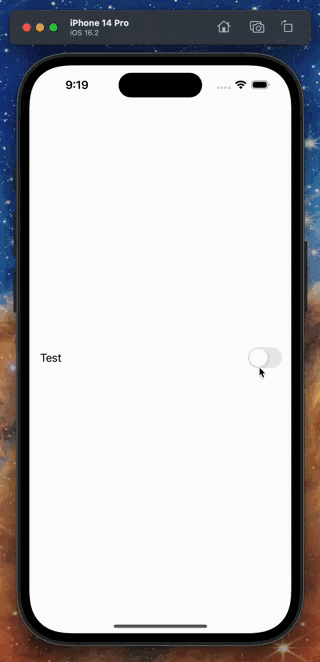
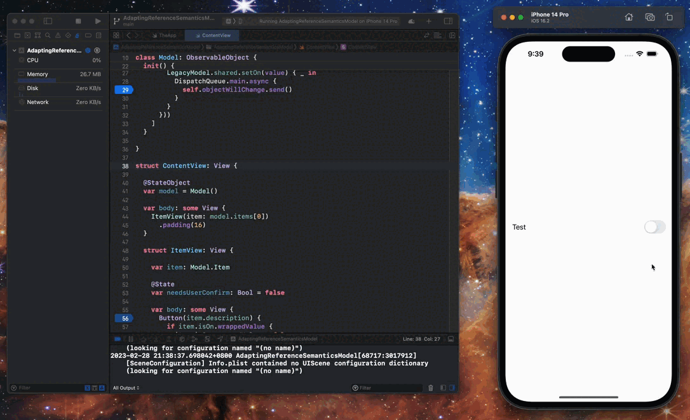
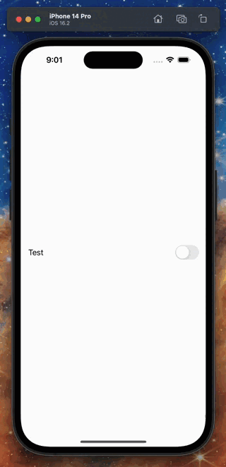
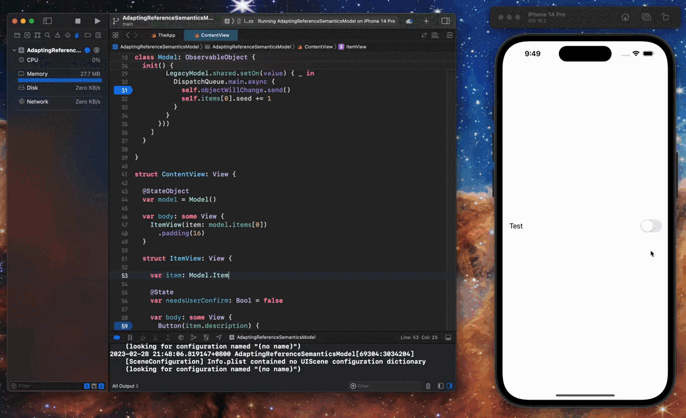
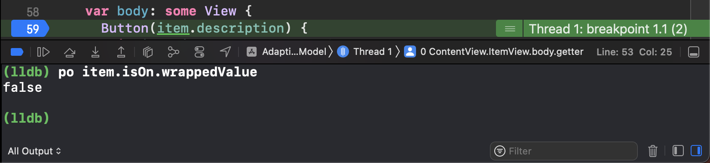
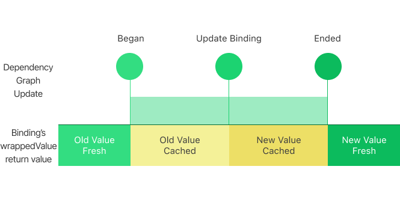

## 介绍

最近，我的一位同事试图将引用语义模型用 `ObservableObject` 和 `@StateObject` 迁移到 SwiftUI。由于网上有很多关于用这种方式来迁移引用语义模型到 SwiftUI 的例子，在这篇文章中我不打算重点讨论这种方法的一般情况，而是想重点讨论在我和我的同事寻找答案使其代码正常工作的过程中发现的更有价值的三个话题。这些话题是：

- 在 SwiftUI 中真相源 (Source of Truth) 是什么？

- 在 SwiftUI 中如何正确地构成一个真相源？

- 在构成真相源的过程中如何处理引用语义世界常见的异步方法？

由于对上面三个话题的错误理解交织在了一起，我的同事花费了一天多的时间来解决问题。下面，我将一一介绍这三个话题。

## 最开始的问题

我的同事想实现一个需要用户二次确认的开关。



开关下面的 Model 是来自 Objective-C 的遗留代码——当然是引用语义的。此外，setter 是一个异步方法，有一个 completion block。

```swift
class LegacyModel {
  
  // getter
  var isOn: Bool { get }
  
  // 异步 setter
  func setOn(_ newValue: Bool, completion: ((_ success: Bool) -> Void)?)
  
}
```

首先，他使用 `ObservableObject` 来迁移 Objecitve-C 模型，并使用下列异步 setter 进行适配，其中包含：

- 一个函数式 `Binding`

- 一个来自 completion block 的对 `ObservableObject.objectWillChange.send()` 的调用

```swift
import SwiftUI
import Combine

class Model: ObservableObject {

  struct Item {
  
    let description: String
    
    let isOn: Binding<Bool>
  
  }

  @Published
  var items:  [Item] = []
  
  init() {
    items = [
      Item(
        description: "Test",
        isOn: Binding {
          LegecyModel.shared.isOn
        } set: { newValue, tnx in
          // 异步设值
          LegecyModel.shared.setOn(newValue) {
            DispatchQueue.main.async {
              self.objectWillChange.send()
            }
          }
        }
      )
    ]
  }
  
}

```

下面是实现用户界面的代码。

```swift
struct ContentView: View {

  @StateObject
  var model = Model()
  
  var body: some View {
    ItemView(item: model.items[0])
  }
  
  struct ItemView: View {
  
    var item: Model.Item
    
    @State
    var needsUserConfirm: Bool = false
    
    var body: some View {
      Button(item.description) {
        if item.isOn.wrappedValue {
          item.isOn.wrappedValue = false
        } else {
          needsUserConfirm = true
        }
      }
      .buttonStyle(ToggleButtonStyle(isOn: item.isOn.wrappedValue))
      .alert("Sure?", isPresented: $needsUserConfirm) {
        Button("OK") {
          item.isOn.wrappedValue = true
        }
        Button("Cancel", role: .cancel) {}
      }
    }
  }
}

// 我们想要 Toggle 的视觉样式，但是点击行为是 Button 的。
struct ToggleButtonStyle: ButtonStyle {
  
  var isOn: Bool
  
  func makeBody(configuration: Configuration) -> some View {
    Toggle(isOn: .constant(isOn)) {
      configuration.label
    }
    .allowsHitTesting(false)
    .contentShape(Rectangle())
  }
  
}
```

但在上面的代码中，他永远无法通过点击「OK」按钮将开关切换为开启状态。


## 修改一：什么在驱动 SwiftUI 的更新？

在第一眼看到这个问题时，我认为他的代码没有遵循 SwiftUI 基于值 (value-based) 的更新模式。
SwiftUI 会随着值的更新而更新。由于 `Model.Item` 中没有存储属性的改变（都是 `let` 属性），因此 SwiftUI 无法检测 `Binding` 背后的变化。

```swift
class Model: ObservableObject {

  struct Item {
  
    let description: String
    
    let isOn: Binding<Bool>
  
  }
  
}
```

我们可以通过在设置断点的情况下运行程序来验证这一点。 在调用 `self.objectWillChange.send()` 之后，`ItemView.body` 将不会被求值。



为了帮助我的同事赶上他的截止日期，以最少的力气解决这个问题，我建议我的同事将他投喂给 SwiftUI 的 `Model` 像下面这样扩充一下：

```swift
class Model: ObservableObject {

  struct Item {
  
    let description: String
    
    let isOn: Binding<Bool>
    
    // 添加字段
    var seed: UInt8
  
  }
  
}
```

然后，他就可以在调用 `self.objectWillChange.send()` 时通过增加 `Model.Item.seed` 的值来驱动 SwiftUI 对 `ItemView.body` 进行求值了：

```swift
class Model: ObservableObject {

  ...
  
  init() {
    items = [
      Item(
        description: "Test",
        isOn: Binding {
          LegecyModel.shared.isOn
        } set: { newValue, tnx in
          // 异步设值
          LegecyModel.shared.setOn(newValue) {
            DispatchQueue.main.async {
              self.objectWillChange.send()
              self.items[0].seed &+= 1
            }
          }
        }
      )
    ]
  }
}

struct ContentView: View {

  ...
  
  struct ItemView: View {
    
    ...
    
    var body: some View {
      Button(item.description) {
        ...
      }
      .buttonStyle(BySeedUpdateToggleButtonStyle(isOn: item.isOn.wrappedValue, seed: item.seed))
      ...
    }
    
  }
  
}

struct BySeedUpdateToggleButtonStyle: ButtonStyle {
  
  var isOn: Bool
  
  var seed: Int
  
  func makeBody(configuration: Configuration) -> some View {
    Toggle(isOn: .constant(isOn)) {
      configuration.label
    }
    .allowsHitTesting(false)
    .contentShape(Rectangle())
  }
  
}

```

在他修改了代码、编译并运行了程序后，我们期待着奇迹发生——但最终没有任何改变。他仍然无法通过点击「OK」按钮来让打开开关。



但是现在 SwiftUI 会开始对 `ItemView.body` 进行求值了。



这个修改有什么问题？

## 修改二：理解 Dynamic Property 更新

通过在他的代码中设置断点我们可以发现，即使我们通过增加 `Model.Item.seed` 的值来强制要求 SwiftUI 对 `ItemView.body` 进行求值，`Binding` 的 `wrappedValue` 也不会改变。



由于我的同事使用的是函数式 `Binding` 而不是从 `State` 投影的 `Binding`，你可能直觉上会认为函数式 `Binding` 的 `wrappedValue` 会直接返回在 `Binding` 实例化中使用的 `get` 闭包的结果。这可以用以下伪代码表示。

```swift
@propertyWrapper
struct Binding<Value> {

  let transaction: Transaction

  let getter: () -> Value
  
  let setter: (Value, Transaction) -> Void
  
  var wrappedValue: Value {
    get {
      getter()
    }
    set {
      setter(newValue, transaction)
    }
  }

}
```

但这是面向实现的思维--首先你知道了这个 `Binding` 的底层实现，然后根据底层实现的事实推断出了这种行为。

### 深入理解 Binding

要理解上述示例中我们观察到的 `Binding` 上 bug 一样的行为，我们必须更加深入地了解 `Binding`。

在 SwiftUI 中，`Binding` 具有特殊的意义--`Binding` 是 SwiftUI 中受管理动态数据的「引用」。这里的「受管理动态数据」是指能够投影 `Binding` 的 dynamic property。SwiftUI 的文档称这些 dynamic property 为「真相源 (Source of Truth)」。这一点可以从 iOS 16 SDK 中随附文档中 `Binding` 的部分得到验证：

> Binding
>
> A property wrapper type that can read and write a value owned by a source of truth.

但是我认为「受管理动态数据」是一个更不容易引发歧义的称呼，因为你必须先让这些 dynamic property 被 SwiftUI 管理了，然后它们才能按照你的期望工作。为了让这些 dynamic property 被 SwiftUI 管理起来，你必须直接将它们安装在 SwiftUI 提供的 `View`, `Gesture` 或其他用户界面结构类型上:

```swift

struct ContentView: View {

  // 直接安装在 `View` 上
  @State
  var data: Int = 0
  
  var body: some View {
    ...
  }

}
```

因此，我们可以知道，`Model.Item` 里面第一个问题是 `Model.Item` 的 `Binding` 属性没有被直接安装在 `View` 上。

另一方面，由于 `Binding` 被设计为**受管理动态数据**的引用，并且 SwiftUI 实现了事务更新模式来让这些数据在 dependency graph 更新期间保持一致性，因此 `Binding` 也会遵循这个事务更新模式。更详细的说，`Binding`：

- 在初始化时以及 dependency graph 更新它时缓存最新值

- 当 dependency graph 更新时，返回缓存值



这种机制带来了 `Model.Item` 中的第二个问题：当我们在 `View.body` 求值时读取 `Binding` 时总是返回其在实例化时的值。而 `View.body` 的求值发生在 dependency graph 更新期间，为了遵守事务更新模式 `Binding` 会返回其缓存值。 由于 `Model.Item` 的 `Binding` 属性不受 SwiftUI 管理，因此它的缓存值永远不会被更新。 因此，我们可以看到上面类似 bug 一样的行为。

### 一个奏效的修改

那到底有没有方法可以以最少的力气让代码正常工作？

还是有的。

对于符合 `DynamicProperty` 协议的第三方定义的类型，在其被安装的 `View` 的 `body` 被求值之前，其 `update` 方法会被唤起一次。通过这个 `update` 方法我们仍然有机会在 `ItemView.body` 开始求值之前手动「管理」 `Model.Item` 上 `Binding` 属性的更新。

因此，我们可以创建一个新的 dynamic property 用来包装 `@StateObject`，并在 `DynamicProperty.update` 中手动重置 `@StateObject` 的内容。

```swift
import SwiftUI

protocol Remakable {
  
  func remake()
  
}

@propertyWrapper
struct RemakableStateObject<ObjectType: ObservableObject & Remakable>: DynamicProperty {
  
  var wrappedValue: StateObject<ObjectType>
  
  func update() {
    wrappedValue.wrappedValue.remake()
  }
  
}
```

然后我们就需要修改 `Model` 以符合我们刚刚声明的 `Remakable` 协议了。

```swift
class Model: Remakable, ObservableObject {
  
  struct Item {
    
    var description: String
    
    var binding: Binding<Bool>
    
  }
  
  var items: [Item] = []
  
  init() {
    remake()
  }
  
  func remake() {
    items = [
     Item(description: "Test", isOn: Binding(get: {
       LegacyModel.shared.isOn
     }, set: { [unowned self] value in
       LegacyModel.shared.setOn(value) { _ in
         DispatchQueue.main.async {
           self.objectWillChange.send()
         }
       }
     }))
   ]
  }
  
}
```

最后，我们需要给 `@StateObject var model: Model` 添加一个额外的 property wrapper -- `@RemakableStateObject` 才能让代码正常工作。

```swift
struct ContentView: View {
  
  @RemakableStateObject
  @StateObject
  var model = Model()
  
  ...
  
}
```

现在我们可以通过点击「OK」按钮来使开关切换到开启状态了。


## 建议解决方案：构建一个合格的真相源

我的同事一直坚持用函数式 `Binding` 来包装引用语义模型，因为他将包装的引用语义模型视为「唯一真相源」。这是对 SwiftUI 中这个概念的误解。

通过上述解释，我们已经知道 SwiftUI 中合格的「真相源」是安装在 `View`, `Gesture` 或其他结构性用户界面类型上的 dynamic property。这是将引用语义模型迁移到 SwiftUI 世界的最简单、最恰当的方式。

对于我同事的情况，我们依然可以让模型遵从 `ObservableObject`，但是我们必须把 `isOn` 改成普通的 `Bool` 类型。

```swift
class Model: ObservableObject {

  struct Item {
  
    let description: String
    
    let isOn: Bool
  
  }
  
}
```

那么我们如何处理引用语义模型中的异步 setter 呢？解决方案是：在异步 setter 完成工作后，我们需要使用「引用」来设置 `@StateObject var model: Model` 中 `Model.Item` 的新值。

如我上面所提到的，「引用」在这里是指的 `Binding`。

首先，我们需要在异步 setter 完成后获取要修改的数据的 `Binding`。我们可以在 `ItemView` 中调用 `$item` 来获得 `Model.Item` 的 `Binding`。

```swift
struct ItemView: View {
    
  @Binding
  var item: Model
    
  @State
  var needsUserConfirm: Bool = false
    
  var body: some View {
    Button(item.description) {
      if item.isOn {
        // `setOn` 封装了对异步 setter 的调用
        item.setOn($item, false)
      } else {
        needsUserConfirm = true
      }
    }
    ...
  }
```

然后在 `Model.Item` 上声明一个 `setOn` 闭包。这个闭包的参数接收：

- `Model.Item` 的 `Binding`

- 新的值

这样我们就可以在其中填上可定制的同步/异步 setter 调用逻辑了。

```swift
class Model: ObservableObject {

  struct Item {
    
    var description: String
    
    fileprivate(set) var isOn: Bool
    
    var setOn: (_ item: Binding<Item>, _ isOn: Bool) -> Void
    
  }
  
}
```

对于我的同事的情况，当异步 setter 完成时，我们应该拿到 `Model.Item` 的 `Binding`，并将新值设置到 `Binding` 的 `wrappedValue` 中。

```swift  
class Model: ObservableObject {

  ...

  @Published
  var items: [Item] = []
  
  init() {
    items = [
      Item(
        description: "Test",
        isOn: LegacyModel.shared.isOn,
        setOn: { (item, newValue) in
          LegacyModel.shared.setOn(newValue) { success in
            guard success else {
              return
            }
            DispatchQueue.main.async {
              item.wrappedValue.isOn = newValue
            }
          }
        }
      )
    ]
  }
  
}
```


你可能已经发现，在这个解决方案中没有调用 `self.objectWillChange.send()`。这是因为 `Model.Item` 的 `Binding` 支配了 `@StateObject var model: Model` 的变更传播 ———— 对 `@StateObject var model: Model` 的变更帮你调用了 `self.objectWillChange.send()`

## 想要更好的解决方案？关注后续文章

尽管我们已经迭代了 3 个版本的解决方案，但最终解决方案仍不够理想。我们可以看到：

- 用户互动上，具备 `Button` 行为的 `Toggle` 操作起来有点怪异。在这个实现中某些 `Toggle` 的用户互动已经不见了。

- 当异步 setter 完成后，`Toggle` 的关闭动画才开始。这意味着用户可能在真正将注意力从 `Toggle` 上移走之前一直会等待这个 `Toggle` 的关闭动画 ———— 这对于即将失去用户关注焦点的事物而言这不是一个好的设计。如果 `Toggle` 能即刻响应关闭，并在失败发生时重置回已开启的状态，那就会更好。

- 我们必须在 `Item.Model.setOn` 中手动设置异步 setter 的逻辑，这很容易出错。

- 如果引用语义模型提供异步 getter 我们该如何处理？

- 如果异步访问失败了我们该如何处理？

- 在 `ItemView` 中 `Button` 的 `action` 闭包中有可以提取的重复代码

另一方面，真实世界的引用语义模型可能会：

- 只有 getter 方法，没有 setter 方法。

- 只有 setter 方法，没有 getter 方法。

- 在 SwiftUI 之外被修改而没有任何通知。

要处理上述符合情况的引用语义模型，我们需要写更多的代码来让 SwiftUI 中的真相源可以正常工作。

为了保持这篇文章的简洁和聚焦，上面提到的所有要点将在后续的文章中提及。

## 结论

在这篇文章中，我向你展示了：

- SwiftUI 中的真相源是可以投影 `Binding` 的 dynamic property

- 要构成一个合格的真相源，我们必须在 `View`, `Gesture` 或者 SwiftUI 中其他结构性用户界面类型上直接安装 dynamic property

- 通过 `Binding`，我们可以在 SwiftUI 中简单地处理异步方法。
