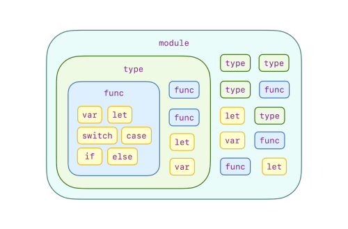
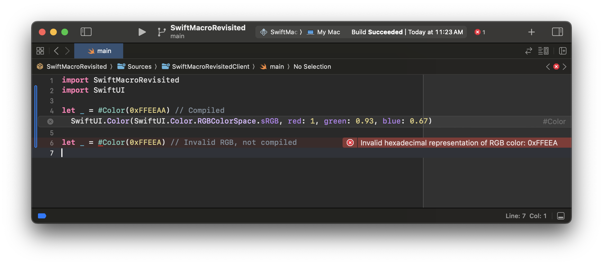
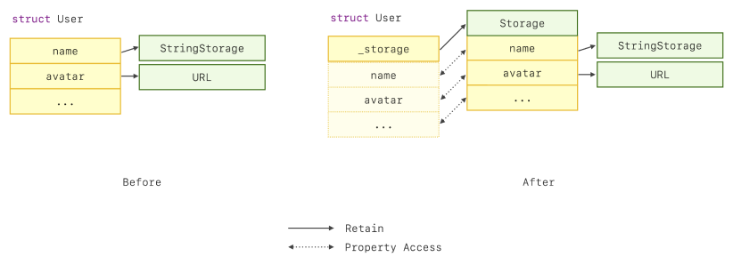
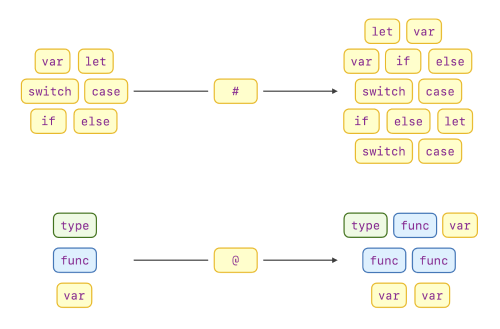

From the sessions at WWDC 2023, we learned that Swift Macro aims to:

- Eliminate boilerplates
- Make tedious things easy
- Share with other developers in packages

However, these goals aren't unique to Swift Macro. They are common
objectives for many code reuse methods in Swift, such as functions, types,
and modules. One could argue that all high-level programming languages
aspire to these ends. There must be something else that Swift Macro excels
at; otherwise, it would be redundant.

So, what is it that Swift Macro does exceptionally well?

The answer to this question is crucial. The unique strengths of Swift
Macro defined its essence. It can guide us in crafting Swift macros that
are effective, inform us of the boundaries when creating them, and
ultimately lead us to produce well-designed Swift macros.

To grasp this, we need to first comprehend the problems that existing code
reuse methods in Swift have managed to solve and their limitations. The
key to understanding what sets Swift Macro apart lies in this exploration.

## What Existing Code Reuse Methods Managed To Solve?

In Swift, the methods for code reuse encapsulate the code at various
levels of granularity, from the finest functions to the coarsest modules.
This design offers a hierarchical toolset to help us eliminate
boilerplates in our code at each level.

However, a well-designed code reuse method not only means to eliminate
unnecessary copy-and-pastes but also brings order to chaos. From the
high-level programming language developer's perspective, the chaos usually
comes from unexpected lookup results for the names of variables, functions
or types and unexpected execution order of the program.

More than that, real-world code reuse stories often involve codes provided
by various parties. This means for the compiled programming languages the
code to reuse might be in variant distribution forms: either the source
code or prebuilt libraries.

Let's explore how existing Swift code reuse methods handle all these well.

### Functions

Swift functions are the finest code reuse method in Swift. Programmers
encapsulate basic algorithms by organizing sequences of execution flows
with control structures such as `if ... else ...` statement, `while` loop,
`for` loop and `return` statement. Variables declared within the block of
a control structure have higher lookup priority than those declared
outside. There is a piece of code that illustrates an example of this.
Each line represents a name lookup result.

```swift
// A global variable decalred at the top level of a source file
var bar: Int = 0
//   ^
//   |
//   +---------------------------------------------------+
func foo() {                                          // |
  func getHexDescription(for index: Int) -> String {  // |
    return "0x" + String(index, radix: 16)            // |
  }                                                   // |
  for i in 0..<100 {                                  // |
    // A local variable declared in a for loop           |
    let bar = getHexDescription(for: i)               // |
//       ^                                               |
//       |                                               |
//       +--------- +                                    |
//                  |                                    |
    print("bar = \(bar)")                             // |
  }                                                   // |
// +-----------------------------------------------------+
// |
  bar += 1
}
```

This scene has become familiar in our daily programming. However, this
didn't come easy. The idea behind this design is called structured
programming, defined by several key principles:

- Variables are only accessible within the block of a control structure.
- Control structures could be more expressive like using `if ... else ...`
  instead of a simple `if` statement.
- The goto statement could be eliminated by more advanced control
  structures.
- The function could be defined within other functions.

The very first high-level programming language FORTRAN did not incorporate
these principles as we understand them today. It took the industry several
years to develop and integrate these concepts fully. The idea then
significantly influenced the design and evolution of high-level
programming languages after its introduction. Swift also embraced this
idea to enable programmers to build robust functions.

### Types

Swift types allow programmers to aggregate data and functions that share
internal relationships. This enables code reuse in a greater level of
granularity which is compared to standalone functions.

However, simply packing a bunch of things into one does not eliminate the
complexity. When accessing members declared in a type, there should be
principles similar to the access rules for variables in structured
programming. Such that we can ensure expected name lookup results. Or
there could be endless name collisions across types.

Yet, the internal data and the implementations should not be accessible
outside a particular scope, such as the type or the source file, etc. This
could decrease the mind burden for the programmers that use the type by
exposing only necessary information to the programmers, preventing
undefined behaviors caused by unexpected access to the internal
implementations and defining a limited scope that the type can
collaborate.

Swift types overcome the aforementioned challenges by:

- Type members such as variables and functions declared can be accessed
  within the block of the type definition.
- Introducing the dot-notation syntax to access members outside the type
  block.
- Introducing access control to protect members in a type within a
  particular scope.

```swift
struct Foo {

  // `bar` is private
  private var bar: Int

  func print() {
    // `bar` is acceessible within the block of type `Foo`.
    print(bar)
  }

}

let foo = Foo()
// `print` is acceessible via dot-notation syntax.
foo.print()
```

With all these points, programmers can intuitively expect the name lookup
results when working with types by generalizing what they learned from
Swift functions that adopted principles of structured programming and
bringing the experience got in other languages that have dot-notation
syntax and access control.

### Modules

From the previous section, we saw how Swift enhances code reusability with
types when data and functions share internal relationships. How can we
further improve reusability when types also share these relationships?

An intuitive answer is to further encapsulate types, data and functions
into an abstract at a greater granular level. In Swift, it is what the
module does.

However, in Swift, the module is not simply yet another aggregation of
code. Just like the type system, a naïvely designed module system may also
introduce name collisions across modules and expose unnecessary
implementation details. Swift avoids this by continually generalizing what
we learned from how Swift avoids similar problems in types:

- Module members such as variables, functions and types can be accessed
  within the module.
- Introducing the dot-notation syntax to access members outside the
  module when there are names in different modules collide.
- Introducing access control to protect members in a module within a
  particular scope.

```swift
// In the Foo module

private var name = "foo"

public var version: String {
  return "1.0"
}

public func foo() {
  print(name)
}

// In the Bar module

private var name = "bar"

public var version: String {
  return "2.0"
}

public func bar() {
  print(name)
}

// In the app

import Foo
import Bar

print(Foo.version)
foo()
bar()
```

On top of that, the module is also a way to distribute your code. Since
people may distribute their code either in source code or prebuilt binary,
the Swift compiler may consider this while implementing the module system.


### Recap

By examining the existing code reuse methods in Swift, we can find they
tend to aggregate smaller abstractions into greater ones with a particular
protective mechanism to ensure reasonable name lookup results and expected
program execution flow.



However, what gives them advantages also caps their capabilities. Due to
those protective mechanisms, there are still programming concepts that
cannot be encapsulated -- because some concepts require us to drop this
protection.

To further improve the code reusability of the language, we no longer can
follow the established trends of these existing code reuse methods.

## What Swift Macros Do Exceptionally Well?

Conversely, Swift Macro improved the code reusability of the language by
embracing different design philosophies. To help you build a comprehensive
understanding of these design philosophies, I would like to show you the
nature of Swift Macro with some typical examples.

### Compile-Time Translations and Verifications

Design software like Figma and Sketch represent the RGB color with 6
hexadecimal digits. Developers often extend the type of color to allow
direct copying and pasting of RGB values from design software for use in
Swift:

```swift
import SwiftUI

// Color extension
extension Color {

  public init(_ hex: UInt)

}

// Use example
Color(0xFFEEAA)
```

But how do we verify that the pasted value is a valid RGB color? The
action of copy-and-paste does not ensure the correctness of the result.
The following code snippet shows a potential mistake that results in a
copy-and-paste.

```swift
// Invalid color. 5 hexadecimal digits only
Color(0xFFEEA)
```

However, because Swift macros syntactically transform their arguments to
generate new code, or say "to expand the macro", we can integrate syntax
checking during this transformation. This enables compile-time
verification for 6-digit hexadecimal RGB color "literals".

```swift
#Color(0xFFEEAA) // Compiled
// #Color expansion began
SwiftUI.Color(red: 1, green: 0.93, blue: 0.67)
// #Color expansion ended

#Color(0xFFEEA) // Invalid RGB, not compiled
```



From this example, you may be inspired to see how this compile-time
computability can be applied to other types of "literals".

### Offering Behaviors Beyond The Functions

In practice, we typically aim to avoid using an exclamation mark to
forcefully unwrap optional values:

```swift
func foo(_ bar: Int?) {
  print(bar!)
}
```

Instead, we prefer a safer approach -- use `guard let ... else`:

```swift
func foo(_ bar: Int?) {
  guard let bar else {
    return
  }
  print(bar)
}
```

However, this can be cumbersome, especially with multiple optional
parameters.

Given a programmer's nature, there must be a desire to encapsulate this
unwrapping process for reuse. Unfortunately, since a function protects its
internal execution flow from inner functions' return
**for the sake of structured programming**, we cannot encapsulate this
`guard let ... else` in a function -- because the `return` statement in a
function cannot make the caller site function exit.

```swift
func guard<T>(_ value: T?) -> T {
  guard let value else {
    // This return cannot help `foo` to exit.
    // More than that, this function does not compile.
    return
  }
  return value
}

func foo(_ bar: Int?) {
  let bar = guard(bar)
  print(bar)
}
```

However, Swift Macro provides a feasible method for this type of
encapsulation. We can have a macro called `#unwrap` which has the
following use example:

```swift
func foo(_ bar: Int?) {
  #unwrap(bar) {
    print(bar)
  }
}
```

This could be expanded as:

```swift
func foo(_ bar: Int?) {
  // #unwrap expansion began
  guard let bar = bar else {
    return
  }
  print(bar)
  // #unwrap expansion ended
}
```

In the example above, the arguments of the `#unwrap` macro -- `bar` and
the trailing closure, are type-checked before the compiler initiates the
macro expansion process. This means the `bar` received by `print` in the
trailing closure would be bound to the parameter `_ bar: Int?` of the
`foo` function after the type-check.

However, once the macro expanded, since the expansion process itself could
be seen as a syntax replacement much like the copy-and-paste, the `bar`
used by `print` now is bound to the one declared by the `guard let bar`
statement, being unrelated to the type-check result before the macro
expansion. More than that, the `return` statement brought by this macro
expansion can also affect the control flow of the applied site now.

This example shows the evidence that the expansion of a freestanding Swift
macro could involve **control flow manipulation** and
**lexical scope sharing**.

### Offering Behaviors Beyond Types

The capabilities of Swift Macro are not bound to these boundaries. Let's
consider another kind of Swift Macro: attached macros and showcase its
potential with a real-life example.

In real-world programming, we often start with types with simple
definitions. Here is an example:

```swift
struct User {

  var name: String

  var avatar: URL

}
```

However, as the repository grows, the `struct`s might expand
proportionally:

```swift
struct User {

  var name: String

  var avatar: URL

  var avatarsInDifferentScales: [Int : URL]

  var userID: String

  var socialMedias: [String]

  var brief: String

  // ...

}
```

Since each property in the `struct` of this example requires heap
allocation for data storage, the cost of copying this struct also rises.
The number of heap allocations corresponds to the number of retaining
operations during the copy. Since retaining is atomic, this could
potentially cause lagging in user interactions and waste in memory space.

To minimize the struct's copying cost, we can adopt copy-on-write behavior
to the original struct by aggregating the properties into a class instance
that acts as the storage and copying the storage when altering the
properties:

```swift
struct User {

  // The heap storage type that aggregates the original stored properties
  // in the struct.
  private class Storage {

    var name: String

    // other properties ...

  }

  // The instance of the heap storage.
  private var _storage: Storage

  init(name: String, ...) {
    self._storage = Storage(name: name, ...)
  }

  // Offers copy-on-write behavior.
  private func makeStorageUniqueIfNeeded() {
    if !isKnownUniquelyReferenced(&_storage) {
      _storage = Storage(name: name, ...)
    }
  }

  // A rewritten property in the struct.
  var name: String {
    get { return _storage.name }
    set {
      makeStorageUniqueIfNeeded()
      _storage.name = newValue
    }
  }

  // Other rewritten properties ...

}
```

To understand this technique further, there is an illustration shows the
difference between the working details before and after adopting the
copy-on-write behavior:



This is a useful technique to improve the performance when copying big
`struct`s comes to be the bottleneck. In real-world testing, I improved
the performance of an app produced by ByteDance by adopting this
technique, increasing the FPS of a particular scene from 48 to 56 and
reducing the debug-time overall memory usage by 600MB.

However, the approach I showed above can be cumbersome. It not only
involves a lot of hand-roll code but, worse still, it increases the cost
of maintaining the program.

More than that, this technique cannot be encapsulated with any existing
kind of types in Swift: no matter `class`, `struct`, `enum` or `protocol`.
This is because what I've done to the struct is to extend the type's
behaviors by transforming the existing members into another form. Since we
can only reuse a type with aggregation, inheritance and conformance, none
of this could help us encapsulate this piece of logic.

But Swift Macro offers what we want. We can encapsulate this code
transformation process with Swift Macro and approach what I've done in the
previous example more elegantly.

```swift
@COW
struct User {

  var name: String

  var avatar: URL

  var avatarsInDifferentScales: [Int : URL]

  var userID: String

  var socialMedias: [String]

  var brief: String

  // ...

}
```

Yes. Just as simple as I've shown. By adding an attached macro called
`@COW` to the struct, we have introduced the copy-on-write behavior to
this struct.

What this macro did is nothing more than what we have hand-rolled in the
previous example -- adding heap storage to the struct and transforming the
stored properties into computed properties that forward access to the heap
storage:

```swift
@COW
struct User {

  // @COW expansion began
  private class Storage {

    var name: String

    // other properties ...

  }

  private var _$storage: Storage

  private func makeStorageUniqueIfNeeded() {
    if !isKnownUniquelyReferenced(&_$storage) {
      _$storage = Storage(name: name, ...)
    }
  }

  init(name: String, ...) {
    self._$storage = Storage(name: name, ...)
  }
  // @COW expansion ended

  // @COW expansion began
  @COWIncluded(storage: _$storage)
  // @COW expansion ended
  var name: String {
    // @COWIncluded expansion began
    get { return _$storage.name }
    set {
      makeStorageUniqueIfNeeded()
      _$storage.name = newValue
    }
    // @COWIncluded expansion ended
  }

}
```

However, all these above happen in an automatic process that the Swift
compiler type-checks the `User` struct and then invokes the macro
expansion by using the type-checked `User` struct as an argument. Finally,
the `@COW` macro generates code by understanding the contents in the
`User` struct. With this automatic mechanism, the cost of maintenance has
been eliminated.

From the macro expansion shown above, it can be observed that attached
Swift macros can extend types with members and rewrite properties by
adding accessors. The extended contents not only bring new behaviors to
the type but also share the "namespace" of the extended point. It is also
worth noting that adding accessors to a stored property also changed its
semantics from a stored property into a computed property.

## Conclusion

By studying the existing code reuse methods in Swift and understanding the
characteristics of the newer Swift macros, we can draw the following
conclusions:

- Swift Macro is yet another form of encapsulation. It does not bring any
  new runtime capabilities.
- Swift Macro generates codes by transforming the programmer's code at the
  compile time. This means that we can also integrate compile-time
  verification into it.
- Unlike existing code reuse features in Swift, Swift Macro does not
  protect its expansion from the existing contents of the applied site by
  default. Yet, it also can change the semantics of applied site. Macro
  authors shall watch out for potential traps and pitfalls while
  implementing Swift macros. To be specific:
  - For freestanding Swift macros, they can affect the control flow of the
    applied site as well as share the lexical scope.
  - For attached Swift macros, they can extend members to types as well as
    accessors to properties. The extended contents also share the same
    "namespace" of the extended point. More than that, accessor macros
    could turn a stored property into a computed property by adding either
    the `get`, `set` or other undocumented accessors like `_read`,
    `_modify`, `unsafeAddressor` and `unsafeMutableAddressor`.



These properties offer programmers not only another option for code reuse
but also the ability to encapsulate programming concepts that involve
compile-time checking, control flow manipulations, and adding behaviors to
types without relying on inheritance or other runtime techniques. These
properties have never been implemented in Swift before. Without a doubt,
they are the unique strengths that define Swift Macro.

However, the same features that give Swift Macro its advantages also
introduce potential traps and pitfalls. We will delve into this topic in
the following post.

## Resources

- A playground project that implements the `#Color` and `#unwrap`
  macro (needs `git checkout strengths-and-essence`)

  [WeZZard/SwiftMacroRevisited](https://github.com/WeZZard/SwiftMacroRevisited)

- The production level implementation of the `@COW` macro:

  [WeZZard/COWMacro](https://github.com/wezzard/cowmacro)
