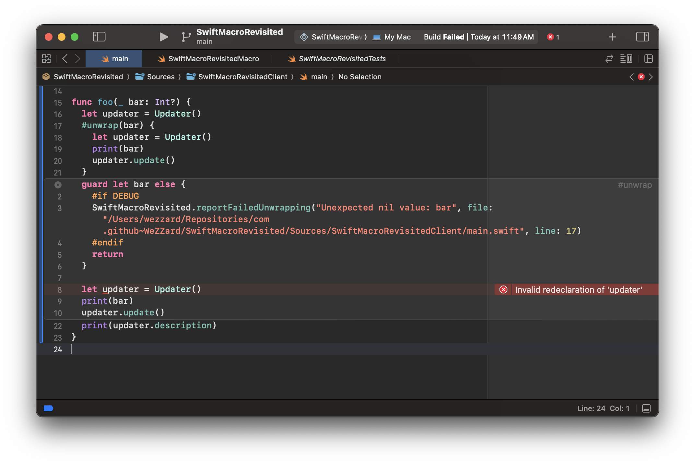
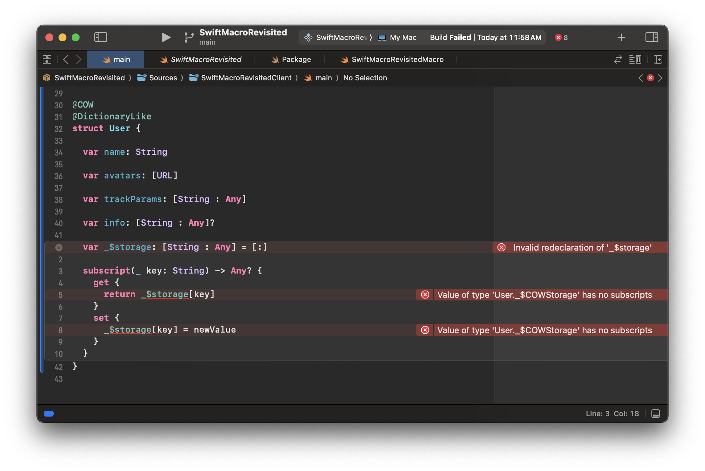
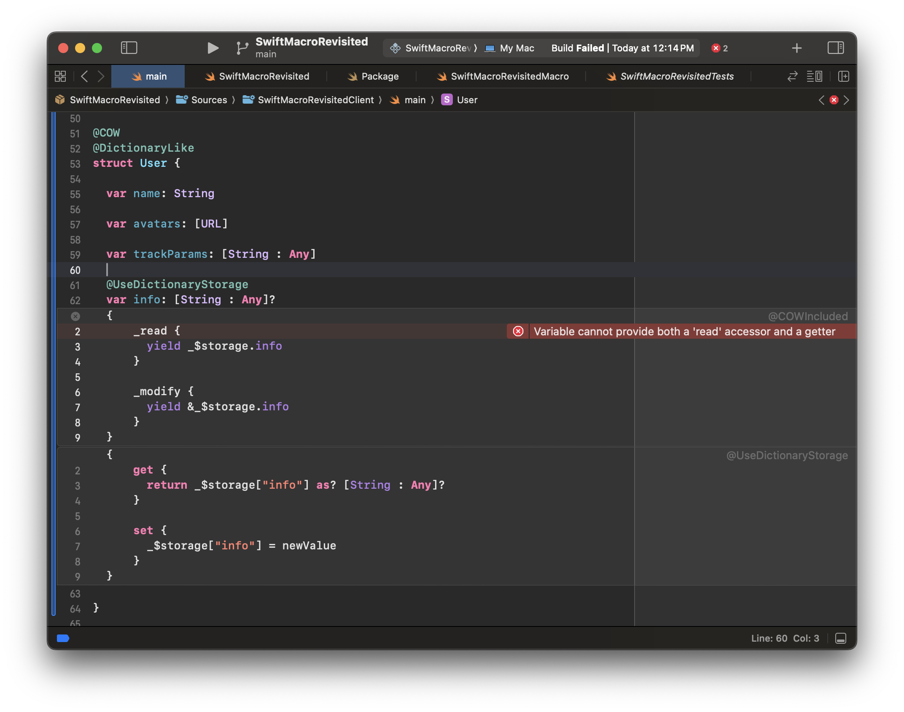
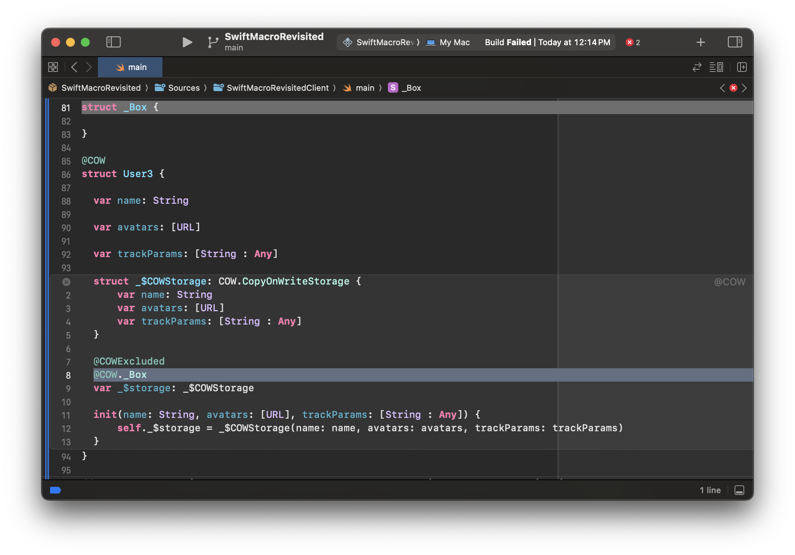
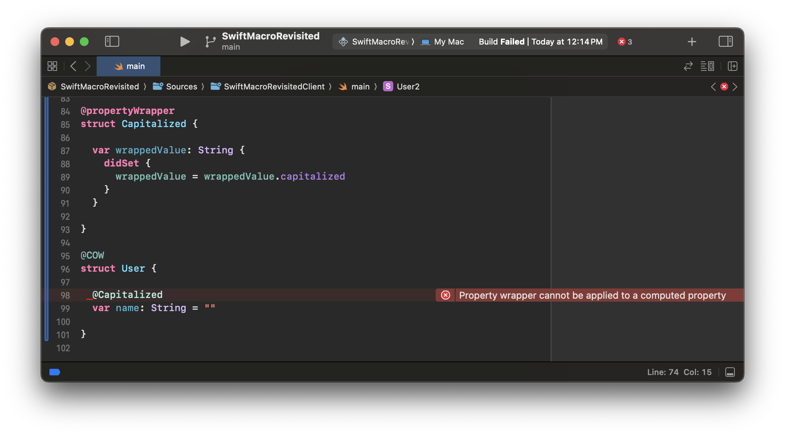
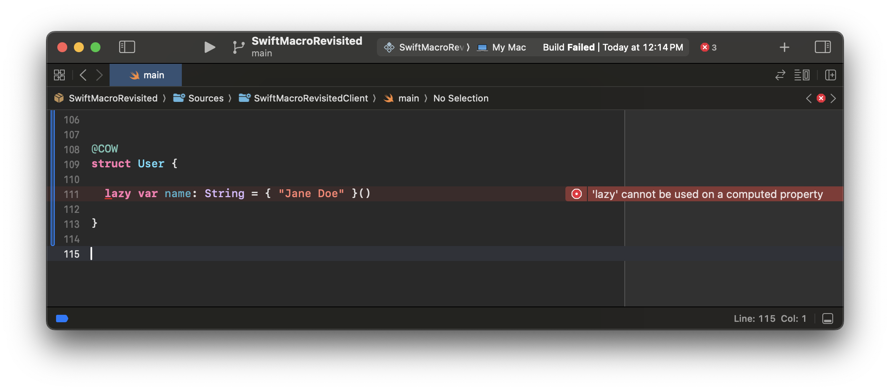
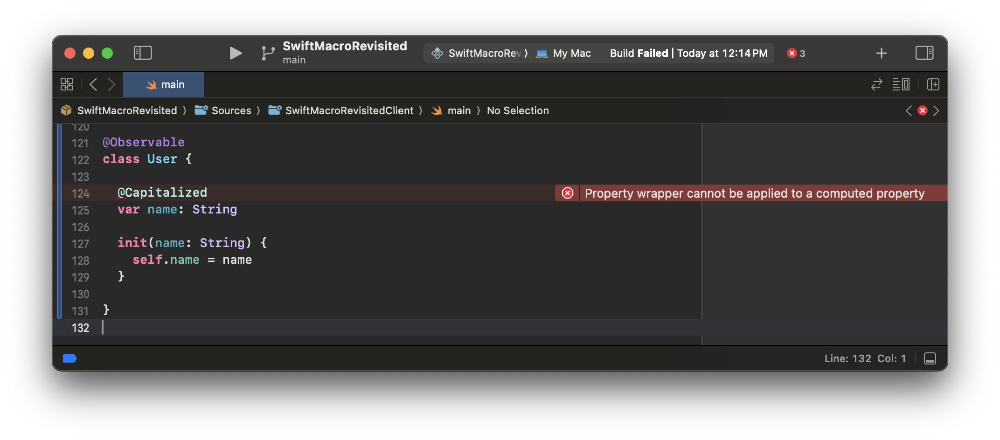
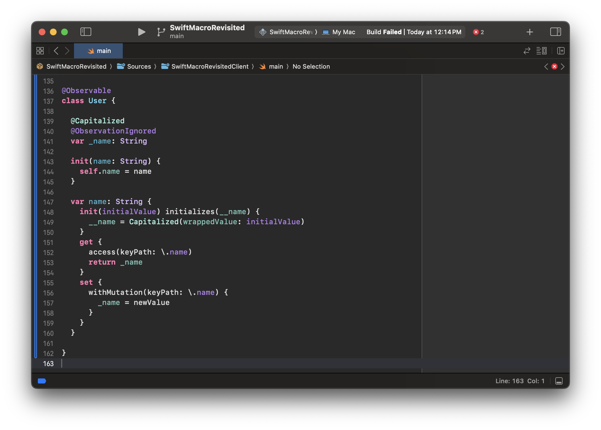
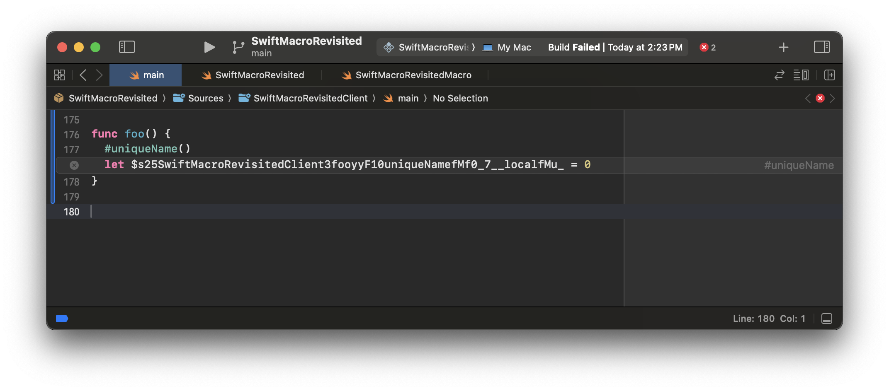
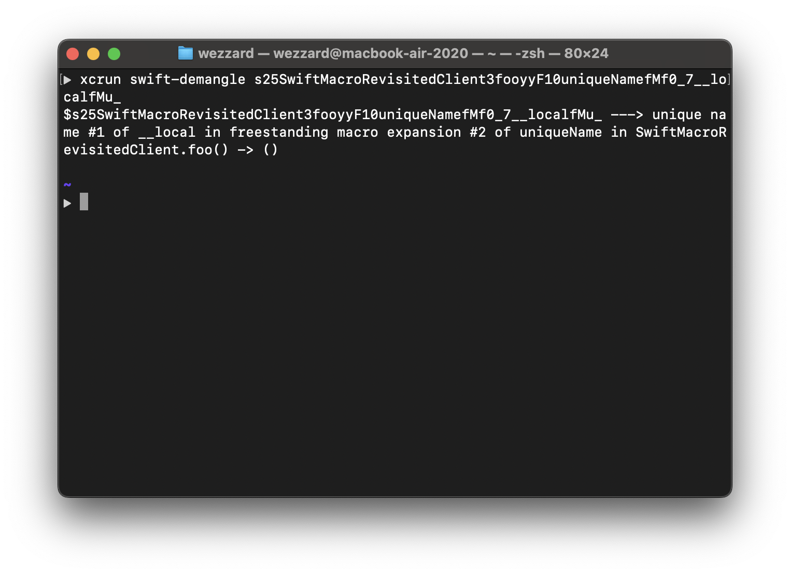

In the previous post, we learned the strengths and the essence that
uniquely define the Swift Macro. The examples in this post work so far so
good. However, can we be confident and bold, implementing any Swift macros
we want now?

No.

The features that bring Swift Macro advantages also introduce traps and
pitfalls that could shoot the programmers themselves in the foot. In this
post, I would like to show you several ones that I've found and how to
overcome them.

## Traps and Pitfalls

### Potential Chaos in Control Flow

The `#unwrap` example in the previous post shows that Swift Macro
expansion could involve **control flow manipulation** and
**lexical scope sharing**:

Before expansion:

```swift
func foo(_ bar: Int?) {
  #unwrap(bar) {
    print(bar)
  }
}
```

After expansion:

```swift
func foo(_ bar: Int?) {
  // #unwrap expansion began
  guard let bar = bar else {
    return
  }
  print(bar)
  // #unwrap expansion ended
}
```

Since the `return` statement in the macro expansion which manipulates the
control flow is an intentional behavior, this would not make us surprised.
But what if we put this macro in a loop? Here is an example:

Before expansion:

```swift
func foo(_ bar: Int?) {
  for _ in 0..<10 {
    #unwrap(bar) {
      print(bar)
    }
  }
}
```

After expansion:

```swift
func foo(_ bar: Int?) {
  for _ in 0..<10 {
    // #unwrap expansion began
    guard let bar = bar else {
      return
    }
    print(bar)
    // #unwrap expansion ended
  }
}
```

From the macro expansion shown above, we can learn that if we pass a
non-optional value to `foo`, the `bar` will only be printed once. This is
because the `return` statement involved by the macro expansion would break
the outer loop.

However, the `#unwrap` macro's name only conveys the purpose of unwrapping
optional values. This might cause the programmer who uses this macro to
think that returning from the applied site is an
**unintentional behavior**.

### Name Conflicts in Freestanding Macros

The odd mentioned above is not the only potential pitfall in the expansion
that I gave for the `#unwrap` macro. One more pitfall here is that the
`bar` variable was re-bound by the `#unwarp` macro after the macro was
expanded. Let's continue to examine that macro expansion:

```swift
func foo(_ bar: Int?) {
  // #unwrap expansion began
  guard let bar = bar else {
    return
  }
  print(bar)
  // #unwrap expansion ended
}
```

This brought variable name shadowing where the `guard let bar: Int`
shadows the argument `_ bar: Int?`. In the case of `#unwrap`, the variable
name shadowing is trivial because it is an intentional behavior. However,
shadowing variables other than the `Optional`s could be considered a bad
practice in real-world programming -- in fact, that would be uncompiled in
Swift. As I concluded before, freestanding Swift macro expansions involve
lexical scope sharing with the applied site. This enables potential
variable shadowing in macro expansions. Here is a contrived example, the
variable name `updater` is shadowed due to the macro expansion:

Before expansion:

```swift
func foo(_ bar: Int?) {
  let updater = Updater()
  #unwrap(bar) {
    let updater = Updater()
    print(bar)
    updater.update()
  }
  print(updater.description)
}
```

After expansion:

```swift
func foo(_ bar: Int?) {
  // `updater` defined the first time
  let updater = Updater()
  // #unwrap expansion began
  guard let bar else {
    return
  }
  // `updater` defined the second time
  let updater = Updater()
  print(bar)
  updater.update()
  // #unwrap expansion ended
  print(updater.description)
}
```

With a clean build in Xcode, you could find this example could not be
compiled:



### Name Conflicts in Attached Macros

Potential name conflicts can arise not only from freestanding macros but
also from attached macros. We can learn this from the `@COW` macro example
in the previous post. Let's recall the macro expansion of this example:

```swift
@COW
struct User {

  // @COW expansion began
  private class Storage {

    var name: String

    // other properties ...

  }

  private var _$storage: Storage

  private func makeStorageUniqueIfNeeded() {
    if !isKnownUniquelyReferenced(&_$storage) {
      _$storage = Storage(name: name, ...)
    }
  }

  init(name: String, ...) {
    self._storage = Storage(name: name, ...)
  }
  // @COW expansion ended

  // @COW expansion began
  @COWIncluded(storage: _$storage)
  // @COW expansion ended
  var name: String {
    // @COWIncluded expansion began
    get { return _$storage.name }
    set {
      makeStorageUniqueIfNeeded()
      _$storage.name = newValue
    }
    // @COWIncluded expansion ended
  }

}
```

You may have noticed that there is a member added in the expansion that is
named with a pattern that has a `_$` prefix.

```swift
  private var _$storage: Storage
```

This is a naming convention that I picked from Apple's implementation of
the macros in Swift Observation and SwiftData which keeps the
implementation details of an attached macro from the programmer's
unintentional access. However, this does not protect those members from
unintentional redeclaration or access brought by other macros -- there
could be other macros that are applied by the programmer that add members
with duplicate names or misuse members added by other macros.

For example, let's say there was a macro called `@DictionaryLike` which
makes the applied type behave like a dictionary by adding a pair of
`subscript` getter and setter. Then we apply `@DictionaryLike` on the
`User` struct we used in the `@COW` macro example:

```swift
@DictionaryLike
struct User {

  // Other contents ...

}
```

The `@DictionaryLike` could be expanded as the following code:

```swift
@DictionaryLike
struct User {

  // Other contents ...

  // @DictionaryLike exapnsion began
  var _$storage: [String : Any] = [:]

  subscript(_ key: String) -> Any? {
    get { return _$storage[key] }
    set { _$storage[key] = newValue }
  }
  // @DictionaryLike exapnsion ended

}
```

Once we stack up `@COW` and `@DictionaryLike` together on the same type,
then there come to the situation that both `@COW` and `@DictionaryLike`
adds a member named `_$storage` to the applied type.

```swift
@COW
@DictionaryLike
struct User {

  // Other contents ...

  // Brought by @COW's expansion
  var _$storage: Storage

  // Brought by @DictionaryLike's expansion
  var _$storage: [String : Any] = [:]

}
```

This obviously would not get compiled in Swift because Swift does not
allow overloads on properties. In this case, we would get the “invalid
redeclaration of a variable” error again.



### Name Conflicts for Unique Language Structures

Some language structures in Swift are unique under the superstructure.
This means when multiple macros try to generate the same substructure in
the same superstructure, the code becomes uncompilable. For example, the
`get` and `set` accessor in a property declaration -- if we add multiple
`get` accessors in a property declaration, then the code does not compile.
This mistake merely happens in hand-rolled code but could be a concern
when we are using macros.

We can delve into this by starting from the previous `@DictionaryLike`
example. Let's consider there is an attached accessor macro called
`@UseDictionaryStorage` which generates `get` and `set` accessor for the
attached property. The getter and setter forward access to the storage
which is brought by the expansion of `@DictionaryLike`.

Before macro expansion:

```swift
@COW
@DictionaryLike
struct User {
  
  @UseDictionaryStorage
  var info: [String : Any]?

}
```

After macro expansion:

```swift
@COW
@DictionaryLike
struct User {
  
  @UseDictionaryStorage
  var info: [String : Any]? {
    // @UseDictionaryStorage exapnsion began
    get {
      return _$storage["info"] as? [String : Any]?
    }
    set {
      _$storage["info"] = newValue
    }
    // @UseDictionaryStorage exapnsion ended
  }

}
```

However, that's oversimplified what happened. The real expansion result
with `@COW` macro is:

```swift
@COW
@DictionaryLike
struct User {
  
  @UseDictionaryStorage
  @COWIncluded
  var info: [String : Any]? {
    // @COWIncluded expansion began
    get {
      _$storage.info
    }
    set {
      makeStorageUniqueIfNeeded()
      _$storage.info = newValue
    }
    // @COWIncluded expansion ended
    // @UseDictionaryStorage exapnsion began
    get {
      return _$storage["info"] as? [String : Any]?
    }
    set {
      _$storage["info"] = newValue
    }
    // @UseDictionaryStorage exapnsion ended
  }

}
```

We can observe that two `get` and `set` accessors are generated under the
`info` property. Since the grammar of the Swift programming language only
allows one `get`/`set` accessor in one property, this expansion would lead
to incorrect syntax in Swift and ultimately make the code not compile.

However, this is actual seeing through a narrow lens. With the production
level implementation of the COW macro, the `get` and `set` accessors are
optimized into `_read` and `_modify` which could offer better performance
in production environment, we can observe that the Swift programming
language forbids the programmer to define accessors that not only with the
same name but actually the same semantics.



### Name Conflicts by Referring Declarations in Other Frameworks

Since we've learned several cases of potential name conflicts caused by
adding declarations, you might think that the list of name conflicts has
ended.

But no. Name conflicts not only can arise from declarations like variables
and property accessors but also references to declarations in other
frameworks. I would like to show you how we could be cornered into this
situation by refactoring the `@COW` macro example.

The `@COW` macro example I've shown above is a naïve implementation -- the
`makeStorageUniqueIfNeeded` function is redundant and can be eliminated by
being extracted into a type called `Box` that is bundled with the library
containing the `@COW` macro. To streamline the use of this type in macro
expansions, we could also make it a property wrapper. Here is the example
code:

```swift
@propertyWrapper
public struct Box<Contents> {
  
  private class Heap {
    
    var contents: Contents
    
    init(contents: Contents) { self.contents = contents }
    
  }
  
  private var heap: Heap
  
  public init(wrappedValue: Contents) {
    heap = Heap(contents: wrappedValue)
  }
  
  public var wrappedValue: Contents {
    get { heap.contents }
    set {
      makeUniqueHeapIfNeeded()
      heap.contents = newValue
    }
  }
  
  private mutating func makeUniqueHeapIfNeeded() {
    guard !isKnownUniquelyReferenced(&heap) else { return }
    heap = Heap(contents: heap.contents)
  }
  
}
```

Then we can attach `@Box` in the `_$storage` property brought by the macro
expansion such that we can eliminate generating the
`makeStorageUniqueIfNeeded` function in place. This reduces the redundancy
and increases the speed of compilation. The macro's implementation is more
sophisticated now.

```swift
@COW
struct User {

  // @COW expansion began
  private struct Storage {

    var name: String

    // other properties ...

  }

  @Box
  private var _$storage: Storage

  init(name: String, ...) {
    self._$storage = Storage(name: name, ...)
  }
  // @COW expansion ended

  // @COW expansion began
  @COWIncluded(storage: _$storage)
  // @COW expansion ended
  var name: String {
    // @COWIncluded expansion began
    get { return _$storage.name }
    set { _$storage.name = newValue }
    // @COWIncluded expansion ended
  }

}
```

However, the type name `Box` may be ambiguous -- there could be other
frameworks that also have a type called `Box`. This ambiguity could also
make the code uncompilable. The following snapshot shows how the
production level implementation of the COW macro resolves this issue:



### Semantics Conflicts

In the `@DictionaryLike` macro example which competes `get` and `set`
accessors with `@COW` macro, we've learned that accessor macros may
affect each other. However, this is not the only potential pitfall brought
by accessor macros: some language features could also be interfered with
by attached macros. Look at the following example: a property wrapper
makes the code not compiled by being attached to a stored property in a
struct applied `@COW` macro.

Before the expansion:

```swift
@propertyWrapper
struct Capitalized {
  
  var wrappedValue: String {
    didSet {
      wrappedValue = wrappedValue.capitalized
    }
  }
  
}

@COW
struct User {
  
  @Capitalized
  var name: String = ""
  
}
```

After the expansion:

```swift
@COW
struct User {
  
  @COWIncluded
  @Capitalized
  var name: String = "" {
    get {
      return _$storage.name
    }
    set {
      makeStorageUniqueIfNeeded()
      _$storage.name = newValue
    }
  }

  // ...

}
```

We got this expansion result because the property wrapper "expansion"
happens later than the macro expansion. With this result, the
`@Capitalized` property wrapper is still attached to the `name` variable
but the variable is changed from a stored property into a computed
property due to the macro expansion. Eventually, we would get an error
diagnosed by the compiler:

> Property wrapper cannot be applied to a computed property



This does not only happen along with property wrappers, the `lazy` keyword
could also lead to the same dead end.

```swift
@COW
class User {
  
  lazy var name: String = { "Jane Doe" }()
  
}
```

```swift
@COW
class User {
  
  @COWIncluded
  lazy var name: String = { "Jane Doe" }() {
    get {
      return _$storage.name
    }
    set {
      makeStorageUniqueIfNeeded()
      _$storage.name = newValue
    }
  }

  // ...

}
```



With these examples, we can learn that the expansion of a Swift macro
could change the semantics of the source code. This could lead to a
semantics conflict and ultimately make the expansion result not compile.

## Solutions: Progressive Control in Macro Expansion

Till now, we've had a list of typical traps and pitfalls that one could
step into while implementing Swift macros. At a glance, this list might
seem overwhelming to you. However, I invented a simple way to get rid of
them: progressive control in macro expansion -- which was derived from the
idea behind "progressive disclosure in API design" and "gradual typing"
and borrowed some ideas extracted from the implementation of Apple's Swift
Observation and SwiftData.

The idea behind "progressive control in macro expansion" is quite simple:
if there are no conflicts, then the programmer shall not make any effort
to workaround them by using conflict-resolving mechanisms. Or, there must
be tools that allow the programmer to resolve the conflicts with minimal
effort.

### Maximize the Probability of the Lucky Case

If a programmer does not have to resolve any conflicts while applying
Swift macros, then we can say the programmer gets a lucky case. To
maximize the likelihood that a Swift macro user encounters a favorable
outcome, we must adhere to the following items:

> Item 1: Macros that manipulate control flow should have names that
> reflect this purpose.

This item is for getting avoid misuse of the previously mentioned
`#unwrap` macro:

```swift
func foo(_ bar: Int?) {
  for _ in 0..<10 {
    #unwrap(bar) {
      print(bar)
    }
  }
}
```

which is expanded into:

```swift
func foo(_ bar: Int?) {
  for _ in 0..<10 {
    // #unwrap expansion began
    guard let bar = bar else {
      return
    }
    print(bar)
    // #unwrap expansion ended
  }
}
```

The programmers could find it much easier to get rid of such a pitfall by
renaming this macro into `#returnIfAnyOptional`.

> Item 2: Put the macro expansion under an "umbrella" if this matches your
> design.

This would make your macro expansion get rid of most member redeclaration
errors. For example, to avoid resolving the name conflict that is caused
by the variable shadowing in the `#unwrap` macro, we can use a **closure**
as the "umbrella" to protect the macro expansion:

Problematic expansion:

```swift
func foo(_ bar: Int?) {
  // `updater` defined the first time
  let updater = Updater()
  // #unwrap expansion began
  guard let bar else {
    return
  }
  // `updater` defined the second time
  let updater = Updater()
  print(bar)
  updater.update()
  // #unwrap expansion ended
  print(updater.description)
}
```

Fixed expansion with closure:

```swift
func foo(_ bar: Int?) {
  // `updater` defined the first time
  let updater = Updater()
  // #unwrap expansion began
  guard let bar else {
    return
  }
  { (bar) in
    // `updater` defined the second time
    let updater = Updater()
    print(bar)
    updater.update()
  }(bar)
  // #unwrap expansion ended
  print(updater.description)
}
```

However, once the body of the closure involves control flows, the closure
would not get inlined by the optimizer in its performance inlining pass.
This could leave the body of the closure out of the local analysis and the
optimization of the macro's apply site. In some cases, this also means to
larger code size. To get rid of this situation, we could use the local
function instead of closure and attribute the local function as
`@inline(__always)` to build the "umbrella".

Fixed expansion with local function:

```swift
func foo(_ bar: Int?) {
  // `updater` defined the first time
  let updater = Updater()
  // #unwrap expansion began
  guard let bar else {
    return true
  }
  @inline(__always)
  func unwrapped(bar: Int) -> Void {
    // `updater` defined the second time
    let updater = Updater()
    print(bar)
    updater.update()
  }
  unwrapped(bar)
  // #unwrap expansion ended
  print(updater.description)
}
```

This "umbrella"-like structure could also be in expansions of attached
macros -- the `@COW` macro's expansion declares a nested `Storage` type as
the storage. This nested type would work like the aforementioned
"umbrella" -- it would protect its member from redeclaration with a type
scope.

```swift
@COW
struct User {

  // @COW expansion began
  private struct Storage {

    var name: String

    // other properties ...

  }

  // Unnecessary expansions ...

  // @COW expansion ended
  
  // Unnecessary contents ...

}
```

> Item 3: Referring types, functions or variables from frameworks other
> than the standard library with fully-qualified names.

In the example of introducing the `@Box` property wrapper to the expansion
of the `@COW` macro, we can find the name `Box` itself could be ambiguous
since other imported frameworks may have a declaration in the same name.
We can fix this by using a fully-qualified name. Let's say the name of the
library is just `COW` then the fully-qualified name of `Box` is `COW.Box`.

The macro expansion before the fix:

```swift
@COW
struct User {

  // @COW expansion began

  // Unnecessary expansions ...
  
  @Box
  private var _$storage: Storage

  // Unnecessary expansions ...

  // @COW expansion ended


  // Unnecessary contents ...

}
```

The macro expansion after the fix:

```swift
@COW
struct User {

  // @COW expansion began

  // Unnecessary expansions ...
  
  @COW.Box
  private var _$storage: Storage

  // Unnecessary expansions ...

  // @COW expansion ended


  // Unnecessary contents ...

}
```

### Minimize the Effort of Resolving Conflicts

However, we cannot ensure the programmers always get the lucky case. There
must be cases where programmers shall resolve the conflicts by themselves.

By applying the aforementioned items, there are still potential name and
semantics conflicts that lie ahead of us. The only thing we can do is to
face and resolve them: since we cannot assume that one single macro author
can predict what names all other macro authors could pick, at the same
time, invariant semantics definitely should not be a property of Swift
macro expansion because it could decrease the flexibility of the Siwft
Macro. An ideal situation would be to have a set of conflict-resolving
tools that lie on a smooth curve of the cost of use. And there they are:

> Item 4: Use the programmer's declarations if something in your macro
> expansion is declared by the programmer.

With this item, the programmer still makes zero effort to resolve the
conflict. The mechanism described in this item is adopted by some AST
transforming language features like `Equatable` and `Hashable` -- the
compiler stops implementing these protocols on behalf of the programmers
if the `Equatable` or `Hashable` has already been implemented by the
programmer. It could also be observed in Swift Observation when the
programmer implemented the `access` function or `withMutation` function.
Since the mechanism itself is ubiquitous, the learning curve should also
be gentle.

> Item 5: Offer a way to rename the declarations in your macro expansion
> when renaming the declarations is possible.

We could test this item in the example of stacking up the `@COW` macro and
the `@DictionaryLike` macro on a single type, the macro expansions of the
two macros generate two `_$storage` variables. To add the renaming
mechanism, we can naturally come up with the idea that to add an argument
to the macro:

```swift
@attached(member, names: arbitrary)
@attached(memberAttribute)
public macro COW(storageName: String) =
  #externalMacro(module: "COWMacros", type: "COWMacro")
```

But this would break the idea behind "progressive control in macro
expansion": if there are no conflicts, then the programmer shall not care
about resolving the conflicts -- with this macro declaration, the
programmer shall always apply this macro with an additional argument this
time. However, what might be something new to you is this also could be
done by macro overloading. This means there could be multiple macros with
the same name but have different "signatures".

```swift
@attached(member, names: arbitrary)
@attached(memberAttribute)
public macro COW() =
  #externalMacro(module: "COWMacros", type: "COWMacro")

@attached(member, names: arbitrary)
@attached(memberAttribute)
public macro COW(storageName: String) =
  #externalMacro(module: "COWMacros", type: "COWMacro")
```

Firstly, let's recall the expansion before adding the renaming mechanism
to each macro.

```swift
@COW
@DictionaryLike
struct User {

  // Other contents ...

  // Brought by @COW's expansion
  var _$storage: Storage

  // Brought by @DictionaryLike's expansion
  var _$storage: [String : Any] = [:]

}
```

Then, there is the expansion after adding the renaming mechanism to each
macro.

```swift
@COW(storageName: "_$cowStorage")
@DictionaryLike(storageName: "_$dictStorage")
struct User {

  // Other contents ...

  // Brought by @COW's expansion
  var _$cowStorage: Storage

  // Brought by @DictionaryLike's expansion
  var _$dictStorage: [String : Any] = [:]

}
```

However, there could be generated declarations that couldn't be renamed,
such as the `get` and `set` accessor. Then we would come to the most
expensive item:

> Item 6: Offer a way to stop code generation when the generated code
> involves unique language structures in a superstructure.

Swift Observation offers a good example for this item and here is the
example: an `@Observable` macro attached class with a property attached
with the `@Capitalized` property wrapper:

```swift
@propertyWrapper
struct Capitalized {
  
  var wrappedValue: String {
    didSet {
      wrappedValue = wrappedValue.capitalized
    }
  }
  
}

@Observable
class User {
  
  @Capitalized
  var name: String

  init(name: String) {
    self.name = name
  }
  
}
```

The code above does not compile due to the property wrapper requires the
`name` to be a stored property but `@Observable` transforms it into a
computed property.



Here is the key part of the macro expansion:

```swift
@Observable
class User {

  // Unrelated expansion ...
  
  @Capitalized
  // @Observable expansion began
  @ObservationTracked
  // @Observable expansion ended
  var name: String {
    // @ObservationTracked expansion began
    init(initialValue) initializes(_name) {
      _name = initialValue
    }
    get {
      access(keyPath: \.name)
      return _name
    }
    set {
      withMutation(keyPath: \.name) {
        _name = newValue
      }
    }
    // @ObservationTracked expansion ended
  }
  
  // Unrelated contents ...
  
}
```

However, since Swift Observation also offers an attached macro called
`@ObservationIgnored` to stop code generation brought by `@Observable` on
applied members, we can make use of this macro to manually resolve the
conflicts.

Firstly, we have to backward the `name` property with an underscore,
attaching `@ObservationIgnored` on it.

```swift
@Observable
class User {
  
  @Capitalized
  @ObservationIgnored
  var _name: String

  // ...

}
```

Then, we can add a `name` property, hand-rolling the observation
mechanism:

```swift
@Observable
class User {

  // ...
  
  init(name: String) {
    self.name = name
  }

  var name: String {
    init(initialValue) initializes(__name) {
      __name = Capitalized(wrappedValue: initialValue)
    }
    get {
      access(keyPath: \.name)
      return _name
    }
    set {
      withMutation(keyPath: \.name) {
        _name = newValue
      }
    }
  }

  // ...
  
}
```

Finally, we resolved this conflict.



> Item 7: An example expansion should be included in the macro's
> documentation.

However, it is not enough to have item 6 alone. The programmers still
could be confused about how to manually "expand" the macro by itself. To
address this, the macro authors should include an example implementation
that shows how to manually expand the macro in its documentation. This
provides programmers with the guidance they need to manually resolve macro
expansion conflicts.

### Why I Didn't Recommend Using makeUniqueName(_:)

From the session at WWDC 2203, we learned that there is a way to get rid
of name collision: use `MacroExpansionContext.makeUniqueName(_:)`.
However, the name generated by this API is unreadable by humans. Here is
an example:



Do you know what it means? At least, I cannot make out what it means at
first glance. We can only understand this by resolving it with
`swift-demangle`:



Since this name could be used at debug-time, being human-readable is
crucial for the sake of the efficiency of understanding the code's
purpose. This is the reason why I didn't recommend using
`MacroExpansionContext.makeUniqueName(_:)`.

## Conclusions

In this post, we listed some typical traps and pitfalls that one could
step into while authoring Swift macros. On top of that, we also discussed
a methodology to resolve all of them: "progressive control in macro
expansion", which involves 2 goals and 7 items.

The goals of this method are:

- If there are no conflicts, then the programmer shall not make any effort
  to work around them by using conflict-resolving mechanisms.
- Or, there must be tools that allow the programmer to resolve the
  conflicts with minimal effort.

The items in this method include:

1. Macros that manipulate control flow should have names that reflect this
  purpose.
2. Put the macro expansion under an "umbrella" if this matches your
  design.
3. Referring types, functions or variables from frameworks other than the
  standard library with fully-qualified names.
4. Use the programmer's declaration if something in your macro expansion
  is declared by the programmer.
5. Offer a way to rename the declarations in your macro expansion when
  renaming the declarations is possible.
6. Offer a way to stop code generation when the generated code involves
  unique language structures in a superstructure.
7. An example expansion should be included in the macro's documentation.

In addition, we also learned that the name generated by
`MacroExpansionContext.makeUniqueName(_:)` is unreadable for human beings.
This decreased the efficiency of understanding the purpose of code during
debugging.

## Resources

- A playground project that implements macros in this post:

[WeZZard/SwiftMacroRevisited](https://github.com/WeZZard/SwiftMacroRevisited), and
don't forget `git checkout traps-and-pitfalls`

- The production level implementation of the @COW macro:

[WeZZard/COW Macro](https://github.com/wezzard/cowmacro)
